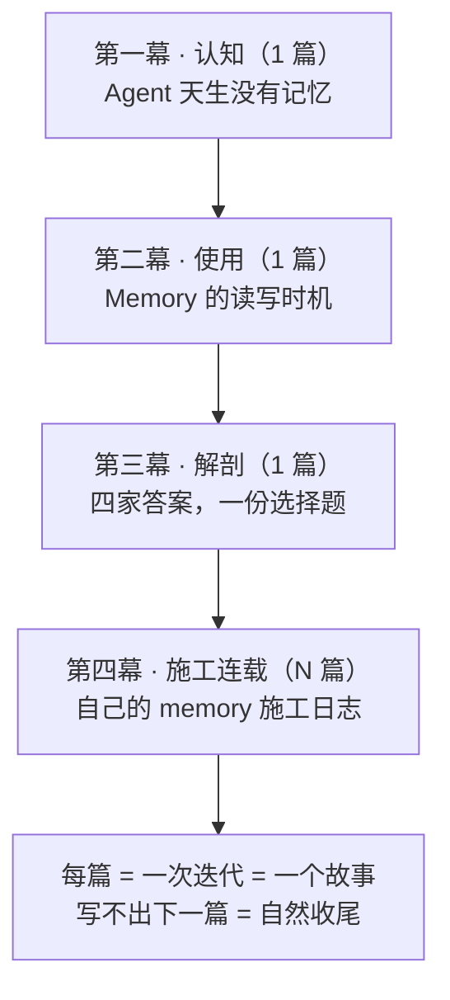

# Memory 系列大纲：给天生无记忆的 Agent 造一个记忆

> [!note]
> 这是一个用叙事方法讲透 Agent Memory 的写作系列。叙事方法论来自 [[0. 写作学习总纲：从故事结构开始学习叙事]]（故事 = 欲望 + 障碍 + 选择 + 代价 + 改变），技术底稿来自本目录的调研文章。目标不是写得像小说，而是**把枯燥的原理放进故事里讲**：70% 技术，30% 故事。

## 1. 系列定位

- **核心主题**：Agent Memory——它是什么、怎么用、怎么实现、怎么构建自己的
- **系列架构**：认知 → 使用 → 解剖 → 施工连载。前三篇闭环（可独立成书），第四幕开放生长（5～10 篇不等，由真实经历决定）
- **读者成长阶梯**：三篇各服务一种读者状态——旁观者 → 使用者 → 构建者；施工连载记录"我"从学习者变成施工者的过程
- **写作原则**：每篇解决一个问题、打开一个问题（钩子链）；每篇内部 State A ≠ State B（推进检查）

## 2. 总路线图



| 幕 | 篇数 | 读者身份 | 回答的问题 | 状态 |
| --- | --- | --- | --- | --- |
| 一 · 认知 | 1 | 旁观者 | Memory 是什么、为什么必须有 | planned |
| 二 · 使用 | 1 | 使用者 | 怎么用好、每条机制的代价 | planned |
| 三 · 解剖 | 1 | 工程师 | 四家怎么实现、差异的本质 | planned |
| 四 · 施工 | N（开放） | 施工者（我） | 怎么在别人基础上做自己的 | planned |

## 3. 第一幕 · 认知（1 篇）

### 篇 1：《Agent 天生没有记忆》

> 备选标题：《无状态的模型，外挂的记忆》

| 要素        | 内容                                                                                     |
| --------- | -------------------------------------------------------------------------------------- |
| 主题句（认知改变） | 记忆不是 Agent 弄丢的东西，是它**从未拥有过的东西**。Agent = 模型 + harness，模型天生无状态，所以记忆只能作为 harness 的能力被外挂上去 |
| 被推翻的旧认知   | "memory 就是聊天记录、存个数据库"；"窗口变大了就不需要记忆了" → context rot 还在                        |
| 欲望        | Agent 连续地认识我：昨天定的方案今天能接着做                                                              |
| 障碍        | 出厂设定，不是故障：**无状态**（每次调用都是初次见面，跨会话归零）+ **有限窗口**（同一会话塞满了，开头也会被挤掉；context rot：塞得越满表现越差）    |
| 选择        | 给 harness 外挂记忆——把状态挪到模型外面。memory 的本质是**添加**一个能力，不是找回一个能力                               |
| 代价        | 注入花预算、检索加延迟、维护花纪律——记忆不是免费的                                                             |
| 引子场景      | 跨会话开场：昨天花一下午定下的技术方案，今天新开会话，它礼貌地问"你好，请问我们今天做什么？"。那一刻我意识到：不是它忘了，是它从来没记得过                 |
| 信息控制      | 定义藏在必要性里讲；先让读者体验"跨会话归零"的落差，再揭示无状态这个出厂设定                                                |
| 结尾钩子      | 记忆装上了，但"装上"和"用好"之间隔着一整套读写时机 → 篇 2                                                      |

**素材来源**：OpenClaw memory overview（"no hidden state"）；Mastra OM 文档的 context rot 论述；Agent = 模型 + harness 的分层认知（[[04.01-pi 与 Mastra 怎么选]] 四层视角，同时是通往篇 3 的桥——记忆长在 harness 上，所以每家 harness 的记忆长得不一样）。

## 4. 第二幕 · 使用（1 篇）

### 篇 2：《Agent Memory 的读写时机》

> 备选标题：《注入、写下、想起：Memory 用起来是什么样》

| 要素 | 内容 |
| --- | --- |
| 主题句（认知改变） | 会用 = 懂它的**读写时机**：何时注入、何时写下、何时想起、何时被遗忘 |
| 被推翻的旧认知 | "配置一下 new Memory({...}) 就有了" |
| 欲望 | Mastra 项目配好四件套（working memory / message history / semantic recall / observational），以为万事大吉 |
| 障碍 | 行为不符预期：它怎么不记这个？怎么记错那个？怎么乱召回？prompt cache 怎么总被打穿？ |
| 选择 | 去搞懂读写时机：working memory 是主模型自己调工具、semantic recall 每轮先查再写、注入有预算、日记只注今天昨天 |
| 代价 | 每条机制都有代价：cache 打穿、embedding 延迟、token 膨胀 |
| 引子场景 | 亲历：我的 Mastra 项目——memory 配置完用得很顺，直到某天想问"这记忆到底是什么时候、被谁写下的"，发现自己在黑盒外面 |
| 信息控制 | 先写"用起来不对劲"的几个真实瞬间，再逐一揭晓机制，最后才给出"读写时机"总表 |
| 结尾钩子 | 懂了用法之后想懂造法——这些机制是谁设计的？为什么每家设计得都不一样 → 篇 3 |

**素材来源**：本人 Mastra 项目经历；[[04.03-Memory 实现原理，谁在什么时候写记忆]] §2–§6；OpenClaw 注入预算 / 今天+昨天自动加载 / 三级召回梯队。

## 5. 第三幕 · 解剖（1 篇）

### 篇 3：《四家答案，一份选择题》

| 要素 | 内容 |
| --- | --- |
| 主题句（认知改变） | 实现差异是**哲学差异**；构建自己的 memory 不是选产品，是做五道选择题 |
| 被推翻的旧认知 | "选一个功能最全的就行" |
| 欲望 | 想直接抄一个最好的实现 |
| 障碍 | 四家（OpenClaw / Mastra / Claude Code / pi）互不兼容、各有取舍，没有"最全" |
| 选择 | 把差异提炼成五道所有实现都必须回答的选择题（见下表） |
| 代价 | 每道选择都要放弃点什么：文件慢、数据库锁、pi 白纸什么都要自己盖 |
| 引子场景 | 同一个需求问四家，得到四种完全不同的答案（对话式呈现四家的"性格"） |
| 对比组织方式 | **按选择题组织，不按产品巡礼**——每道题下面才是四家的答案 |
| 结尾钩子 | 我的答卷写完了（通用 Memory 设计），但纸面设计 ≠ 跑起来的系统——开始施工 → 篇 4+ |

**五道选择题（本篇骨架）**：

| 选择题 | 分歧点 |
| --- | --- |
| 真相放在哪 | 文件（OpenClaw / Claude Code）vs 数据库（Mastra）vs 没有（pi） |
| 谁来写 | 主模型调工具 vs 后台小模型 vs 框架自动 |
| 什么时候遗忘 | token 阈值（Mastra OM）vs 定时做梦（OpenClaw）vs 压缩时（Claude Code） |
| 怎么被想起 | 注入 / 搜索 / 触发短语 / 深召回梯队 |
| 信不信它 | provenance 分离 + 污点门 vs 基本不设防 |

**素材来源**：[[04.03-Memory 实现原理，谁在什么时候写记忆]] 全文；[[04.01-pi 与 Mastra 怎么选]]（pi 白纸派定位）；[[04.02-构建跨 Agent 的通用 Memory]]（作为"我的答卷"收尾）；Claude Code auto memory（⚠️ 写作前需对照当前官方文档核验，不凭记忆写）。

## 6. 第四幕 · 施工连载（N 篇，开放）

**文体是施工日志（build log），不是设计文**：

- 每篇 = 一次迭代 = 一个完整故事（真实场景 → 出问题 → 尝试 → 意外 → 改变）
- 不求尽善尽美：在别人的基础上做一个——**继承设计而不是继承代码**，基座是格式（Markdown + 挂载点约定），OpenClaw/Mastra 的机制是随时可借的零件库
- 钩子自动成立：下一篇 = 下一个暴露的缺陷
- 可随时收尾：没有新问题 = 本阶段写完

**候选篇目（按预期暴露顺序，写时再调整）**：

| # | 暂定题目 | 预期暴露的问题 |
| --- | --- | --- |
| 4 | 基座盘点：这个 vault 就是我的 memory v0.1 | 现状已是一个实例（obsidian 真相层 + wiki 蒸馏层 + AGENTS.md 挂载），缺 journal 隔离、召回、隐私分级 |
| 5 | 第一次"做梦"：手动蒸馏时我在模仿 OpenClaw 的门槛 | 蒸馏无门槛会烂掉 |
| 6 | 让记忆被想起：没有索引时的召回灾难 | 记了但想不起来 = 没记 |
| 7 | import：从 Mastra 项目里抢救记忆 | 只复制、按来源隔离、不合并 |
| 8 | journal 隔离：多个 Agent 写同一个目录之后 | 共写冲突 |
| 9 | 隐私分级：要 export 给别的工具时才慌 | sensitive 内容不能随便出去 |
| 10+ | （开放）lint / 记忆健康度 / …… | 由真实使用决定 |

## 7. 每篇统一内部模板

```text
1. 场景引子（300–500 字）：真实故障或发现，只抛问题不给答案
2. 原理展开（主体）：本篇核心机制，选一个"主角系统"讲透
3. 多家对照（表格 + 分析）：同一问题的不同答案
4. 认知改变收尾 + 打开下一篇的钩子
```

配套纪律：

- **70% 技术 + 30% 故事**，语言朴素，不为小说感堆辞藻
- 因果词显式用：因为 / 所以 / 但是 / 因此 / 不得不——通读时把"然后"换掉
- 每个抽象判断跟一个具体细节（30k 阈值、凌晨 3 点 cron、5–40 倍压缩、最多丢 25% 旧条目……）
- 系统当**配角人物**写：Mastra 工程派（后台小模型军团）、OpenClaw 极简派（一支笔一叠 md）、pi 白纸派（出厂无记忆）、Claude Code 管家派（规矩多）

## 8. 系列级检查表（每篇写完过一遍）

| 检查项 | 问题 |
| --- | --- |
| 推进 | 这篇开始和结束，什么变了？（State A ≠ State B） |
| 钩子链 | 上一篇结尾的问题，是不是这篇的开场？ |
| 人物弧 | 主人公在前三篇是学习者，第四幕起是施工者——身份转变是否成立？ |
| 细节 | 有没有具体数字、时间、动作、对话？ |
| 信息控制 | 哪个答案可以晚一点揭晓？是否做到了先见问题后见原理？ |

## 9. 底稿素材映射

| 底稿 | 喂给 |
| --- | --- |
| [[04.01-pi 与 Mastra 怎么选]] | 篇 3（pi 白纸派、四层视角） |
| [[04.02-构建跨 Agent 的通用 Memory]] | 篇 3 收尾（"我的答卷"）+ 篇 4（基座） |
| [[04.03-Memory 实现原理，谁在什么时候写记忆]] | 篇 2 + 篇 3 主体 |
| OpenClaw 官方文档调研（本会话已完成） | 篇 1 动机、篇 2 使用面、篇 3 对比 |
| 本人 Mastra 项目经历 | 篇 2 引子与骨架 |
| 本 vault 本身 | 篇 4 起点（memory v0.1 盘点） |

## 10. 待定决策（复盘时确认）

| # | 决策点 | 选项 | 当前倾向 |
| --- | --- | --- | --- |
| 1 | 施工连载第一篇从哪起步 | A. 盘点 vault 现状（素材现成，真实）<br>B. 理想 `~/memory` 设计起步（干净但要迁移） | A |
| 2 | 旧 04.01～04.03 三篇技术文的归位 | 保留原地作底稿 / 移入本目录作底稿 / 重编号 | 待定 |
| 3 | 标题风格 | ~~口语故事型 vs 概念型~~ **已定（2026-09-03）**：标题必须直接传达主题（概念型）；个人轶事只做文内引子，不做标题 | 已定 |
| 4 | Claude Code auto memory 细节 | 写篇 3 前对照当前官方文档核验 | 已列入待办 |
