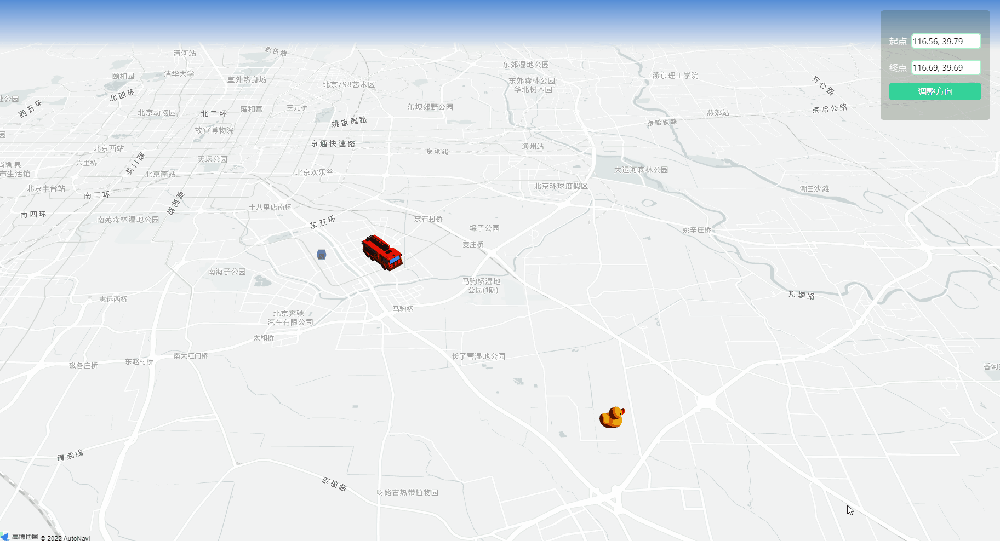
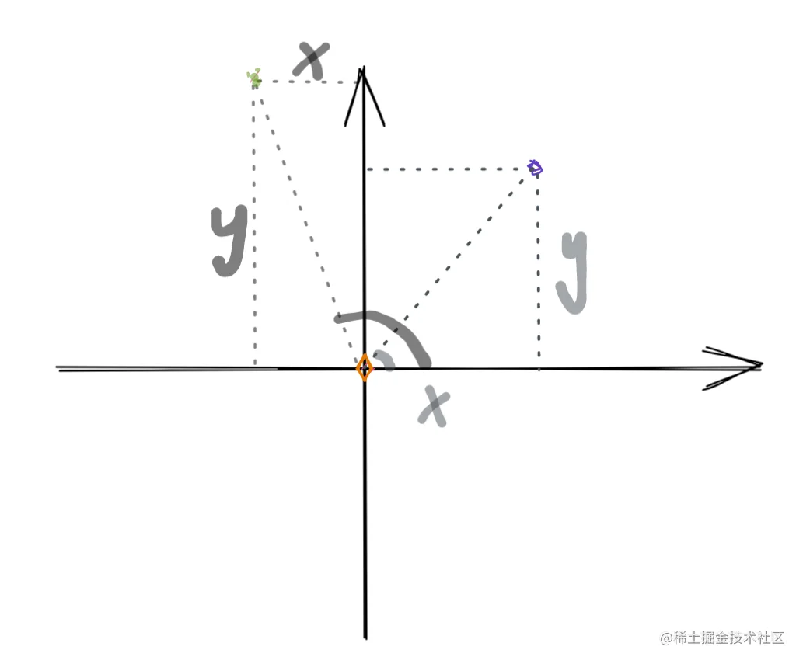
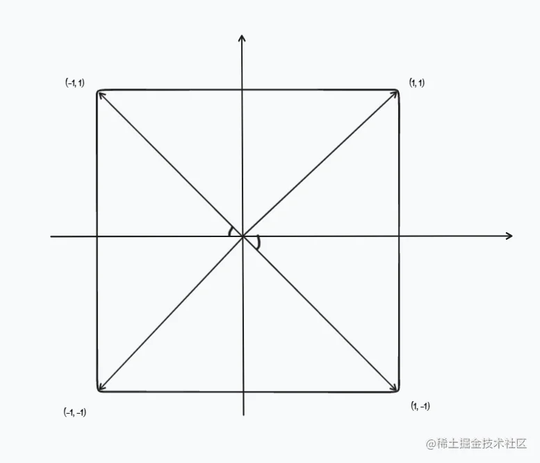
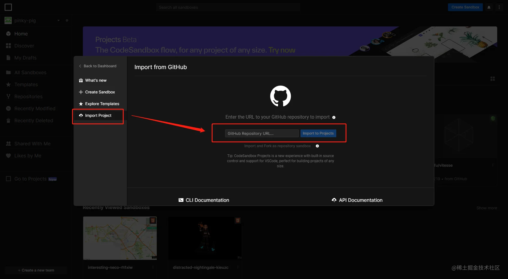
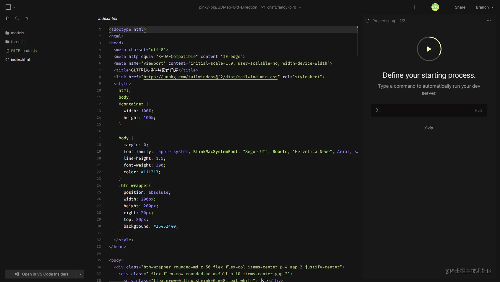
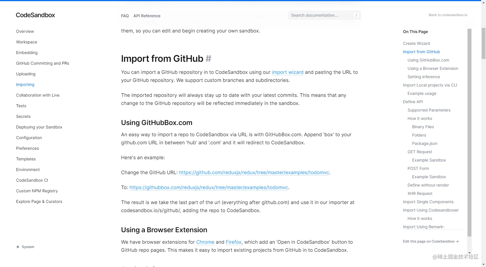
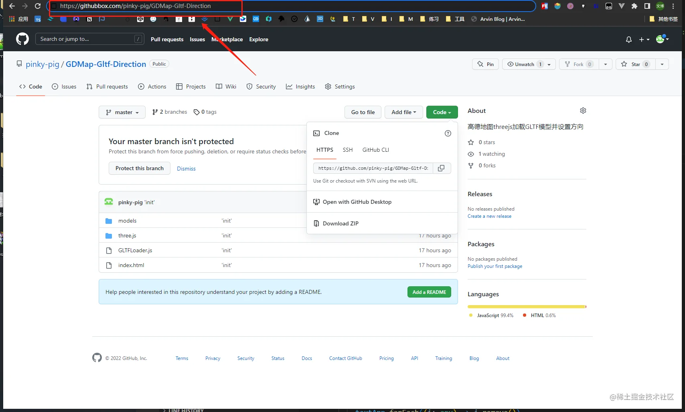
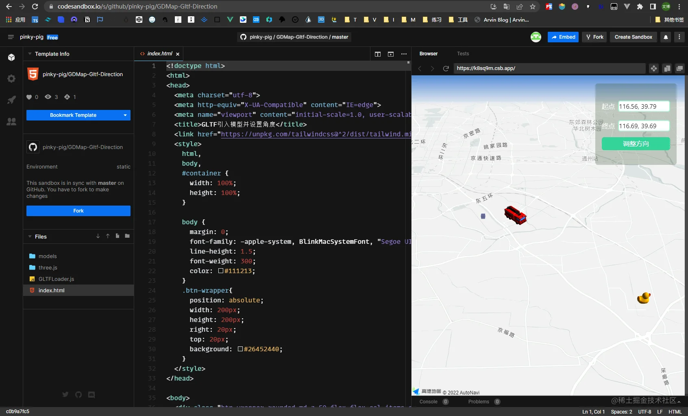

---



# 前言

业务工作中有个需要在高德地图中添加小车模型，并且设置其方向。在高德地图v1.4版本，有暴露出一个类 [Object3D](https://lbs.amap.com/demo/javascript-api/example/object3d-base/add-remove)。不过当前项目使用的是高德API v2.0 版本，[不支持 Object3D](https://lbs.amap.com/faq/js-api/map-js-api/cover/1060854982/)，然后[翻查官网](https://lbs.amap.com/faq/js-api/map-js-api/cover/1060848032/)，最终决定使用 Threejs 来实现这个需求。(代码链接在最后)

# 工具

- 🍌 高德地图 v2.0
- 🍦 Three.js
- 🍉 GLTFLoader.js

# 实现

- 创建高德地图
- 高德地图通过 GLCustomLayer 图层 加载 Three.js
- 引入 GLTFLoader.js 加载模型
- 模型添加到图层上显示
- 根据三角函数计算出两点的角度
- 设置模型的角度

## 计算角度

> 根据三角函数计算角度，无论是否高德地图，思想是通用的。

```js
function calculateAngle(start, end) {
  const distanceX = end[0] - start[0]
  const distanceY = end[1] - start[1]
  const baseAngle = Math.atan2(distanceY, distanceX)
  return baseAngle
}
```

因为我们要求的是两点的方向夹角，很自然的想到了根据坐标系，一点为坐标系原点，另一点在当前坐标系，然后根据`(x,y)`算出角度。于是就使用到了[Math.atan2()](https://developer.mozilla.org/zh-CN/docs/Web/JavaScript/Reference/Global_Objects/Math/atan2)这个方法。



在使用 `Math.atan2(s)`之前，其实是想使用反正切函数`Math.atan(s)`，`s = y / x`，不过其周期范围`[π/2,π/2]`,是在-90度到90度，即180度。那么两个相差180度的角会有相同的正切和斜率，无法根据值进行象限判断，还需通过计算x和y的差值正负判断。



```js
Math.atan(1 / -1) // 第二象限 135度 : -0.7853981633974483
Math.atan(-1 / 1) // 第四象限 315度（-45度） : -0.7853981633974483
```

**`Math.atan2()`** 返回从原点 (0,0) 到 (x,y) 点的线段与 x 轴正方向之间的平面角度 (弧度值)。这是一个逆时针角度，单位是弧度。

```js
const angle = Math.atan2(y, x)
```

其范围是`[-π，π]`，即-180度到180度，周期范围是360度，能够直接根据值判断其象限。弧度制转角度制，因为由公理:360度 = 2π，可得出转化公式：角度 = 弧度 \* 180 / Math.Pi

```js
Math.atan2(1, 1) // 第一象限 45  度   : 0.7853981633974483
Math.atan2(1, -1) // 第二象限 135 度   : 2.356194490192345
Math.atan2(-1, -1) // 第三象限 -135度   : -2.356194490192345
Math.atan2(-1, 1) // 第四象限 -45 度   : -0.7853981633974483
```

## 高德地图引入Threejs

高德地图v2.0提供了一个类[GLCustomLayer](https://lbs.amap.com/demo/jsapi-v2/example/selflayer/glcustom-layer)，可通过这个自定义WebGL图层加载Threejs。

```js
import * as THREE from './three.js/build/three.module.js'
let camera, renderer, scene
const gllayer = new AMap.GLCustomLayer({
  // 图层的层级
  zIndex: 10,
  // 初始化的操作，创建图层过程中执行一次。
  init: (gl) => {
    camera = new THREE.PerspectiveCamera(60, window.innerWidth / window.innerHeight, 100, 1 << 30)
    renderer = new THREE.WebGLRenderer({
      context: gl, // 地图的 gl 上下文
    })

    // 自动清空画布这里必须设置为 false，否则地图底图将无法显示
    renderer.autoClear = false
    scene = new THREE.Scene()

    // 添加的一个几何体
    const mat = new THREE.MeshLambertMaterial({
      side: THREE.DoubleSide,
      color: 0x1E2F97,
      transparent: true,
      opacity: 0.4,
      depthWrite: false
    })
    const geo = new THREE.BoxBufferGeometry(500, 500, 500)
    const mesh = new THREE.Mesh(geo, mat)
    mesh.position.set(116.52, 39.79, 500)
    scene.add(mesh)

    // 环境光照和平行光
    const aLight = new THREE.AmbientLight(0xFFFFFF, 0.3)
    const dLight = new THREE.DirectionalLight(0xFFFFFF, 1)
    dLight.position.set(1000, -100, 900)
    scene.add(dLight)
    scene.add(aLight)
  },
  render: () => {
    renderer.resetState()
    customCoords.setCenter([116.52, 39.79])
    const { near, far, fov, up, lookAt, position } = customCoords.getCameraParams()
    camera.near = near
    camera.far = far
    camera.fov = fov
    camera.position.set(...position)
    camera.up.set(...up)
    camera.lookAt(...lookAt)
    camera.updateProjectionMatrix()
    renderer.render(scene, camera)
    renderer.resetState()
  },
})
map.add(gllayer)
```

## Threejs引入Gltf模型

```js
import { GLTFLoader } from './three.js/examples/jsm/loaders/GLTFLoader.js'

const loader = new GLTFLoader()
loader.load('/models/duck/Duck.gltf', (gltf) => {
  gltf.scene.position.set(data[1][0], data[1][1], 500)
  gltf.scene.scale.set(800, 800, 800)
  gltf.scene.rotation.x = 0.5 * Math.PI
  gltf.scene.position.z = 0.8
  scene.add(gltf.scene)

  models.end = gltf.scene
})

// 添加小车模型
loader.load('/models/car/scene.gltf', (gltf) => {
  gltf.scene.position.set(data[2][0], data[2][1], -800)
  gltf.scene.scale.set(800, 800, 800)
  gltf.scene.rotation.x = 0.5 * Math.PI
  gltf.scene.rotation.y = angle
  scene.add(gltf.scene)

  models.start = gltf.scene
})
```

# 地址

> CodeSandBox体验：[https://codesandbox.io/s/interesting-neco-rh1xiw?file=/index.html](https://codesandbox.io/s/interesting-neco-rh1xiw?file=/index.html)
> GitHub地址：[https://github.com/pinky-pig/GDMap-Gltf-Direction.git](https://github.com/pinky-pig/GDMap-Gltf-Direction.git)

# 附言

我在本地写完这个demo后，写笔记的时候想在线上预览，于是便想到了codesanbox和codepen。这里使用的是codesanbox，记录一下如何从github导入项目并运行。

- 🤡 点击 `New Sandbox`
- 🚑 选择 `Import Project`
- 🚀 复制 github 仓库地址至 Input 输入框后，点击 `Import to Projects`
- 🚠 导入后的项目代码跟别的项目代码界面不太一致，不能直接运行，[翻看官网](https://codesandbox.io/docs/importing#import-from-github)
- 🚀 在 github仓库地址栏的`github.com`改为`githubbox.com`,会自动重定向至sandbox项目










