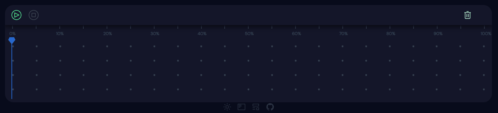
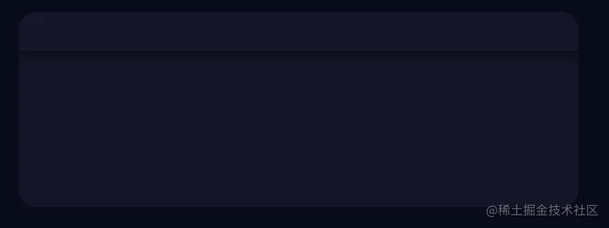
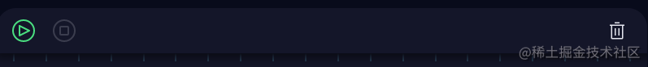
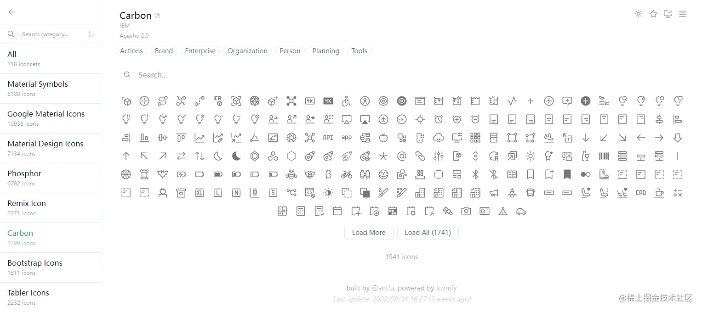
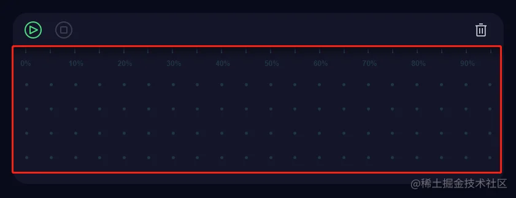
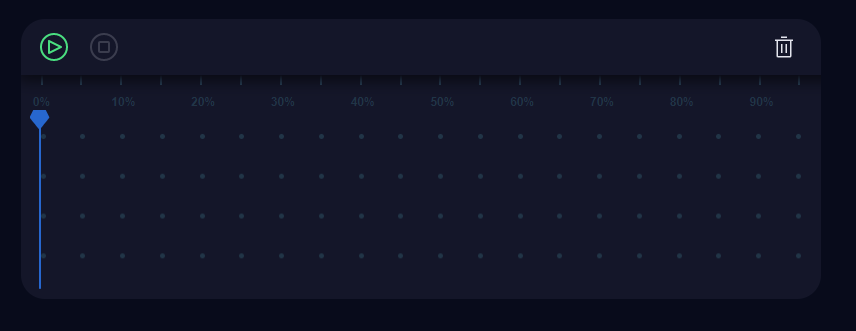

# 前言

因为最近做一个创建Svg动画的Demo，需要一个时间轴展示编辑效果，所以用CSS简单实现了一下😆，其实主要就使用到了animation-play-state属性。

# 代码预览

Stackblitz： [https://stackblitz.com/edit/vitejs-vite-8zkms2?file=src/components/common/Timeline.vue](https://stackblitz.com/edit/vitejs-vite-8zkms2?file=src/components/common/Timeline.vue)

# 技术栈

- [Animation](https://developer.mozilla.org/zh-CN/docs/Web/CSS/animation)
- Vue3
- UnoCSS
  > CSS animation:
  > animation-name -- 动画名字
  > animation-duration -- 持续时间
  > animation-timing-function -- 速度曲线（贝塞尔）： linear...
  > animation-delay -- 延迟时间
  > animation-iteration-count -- 播放次数 ：infinite...
  > animation-direction -- 动画方向 ： normal/reverse/alternate...
  > animation-fill-mode -- 动画不播放的时候，要应用到元素的样式 ：forwards(移动div从左到右，然后就停留 在右)/backwards
  > animation-play-state -- 动画是否暂停 ： paused/running

# 实现步骤

- 🍕上下布局面板
- 🍔播放、暂停、停止图标按钮及动画
- 🍟时间条 body 背景
- 🍳帧线及其移动

## 布局



上下布局，两部分：top、body。flex布局，direction设置column，top元素设置height，body元素flex-1。
top部分设置阴影，box-shadow: 0 2px 15px 4px #00000090;

> flex布局是比较基础的，可参考阮一峰老师的blog学习。http://www.ruanyifeng.com/blog/2015/07/flex-grammar.html
> box-shadow: /_ x 偏移量 | y 偏移量 | 阴影模糊半径 | 阴影扩散半径 | 阴影颜色 _/
> 任意数量的阴影 用逗号隔开就好了

```html
<div
  class="flex flex-col w-800px h-280px rounded-3xl bg-[var(--animate-bg-color)] overflow-hidden"
>
  <!-- top -->
  <div
    class="top w-full h-14 flex flex-row items-center justify-between px-4"
  ></div>

  <!-- body -->
  <div class="w-full flex-1 px-5 min-h-100px"></div>
</div>
```

## 按钮及动画



按钮是从 [@iconify-json/carbon](https://icones.netlify.app/collection/carbon) 拿的。



```html
<button class="rounded-full">
  <div
    class="w-8 h-8 cursor-pointer bg-green-400 animate-btn"
    i="carbon-play-outline"
  />
</button>
<div
  class="w-8 h-8 cursor-pointer bg-green-400 animate-btn"
  i="carbon-pause-outline"
/>
<div
  class="w-8 h-8 cursor-pointer bg-green-400 animate-btn"
  i="carbon-stop-outline"
/>
```

动画主要是配合 [transition](https://developer.mozilla.org/zh-CN/docs/Web/CSS/transition) 设置 [`outline`](https://developer.mozilla.org/zh-CN/docs/Web/CSS/outline)。outline 跟 border 差不多，不过区别是 outline 不占据空间，绘制于元素内容周围。**`outline-offset`**用于设置 outline 与一个元素边缘或边框之间的间隙。

> CSS transition:
> transition-property -- 指定CSS属性的name，transition效果
> transition-duration -- 持续时间
> transition-timing-function -- 指定CSS属性的name，transition效果
> transition-delay -- 延迟时间

```css
button {
  outline: 2px dotted transparent;
  outline-offset: -2px;
  transition:
    outline 0.12s ease,
    outline-offset 0.12s ease;
}
button:focus {
  outline: 2.5px dashed var(--primary-color) !important;
  stroke-dashoffset: 12px;
  outline-offset: 2px;
  transition:
    outline 0.12s ease,
    outline-offset 0.12s ease;
  transform: scaleX(1.1) scaleY(1.1);
}
button:active {
  outline: 2px dotted transparent;
  transform: scaleX(1) scaleY(1);
}
```

## 时间线及body 背景



### 时间线

以 5% 为一个单位，从0到100%，共有21个数， `v-for="item,index in 21"`中 item 是从 1 到21 ，index是从 0 到 20 。

```html
<div class="tick" v-for="i in 21" :key="i">
  <b>{{(i*5) - 5}}%</b>
</div>
```

### 样式

“父相子绝”定位，子元素21个flex && justify-between，nth-child(even) 偶数不显示文字。

```css
.timelineTicks {
  @apply absolute w-full top-0 left-0 flex flex-row justify-between;
  .tick {
    height: 10px;
    width: 2px;
    font-size: 0.6em;
    position: relative;
    background: linear-gradient(360deg, currentColor, #00000000);

    b {
      position: absolute;
      width: 20px;
      text-align: center;
      left: 50%;
      bottom: -14px;
      margin-left: -10px;
      top: 15px;
    }

    &:nth-child(even) {
      b {
        display: none;
      }
    }
  }
}
```

2. 背景的话，点状背景，本来打算直接使用 svg pattern 宽高铺满，但是考虑到后面列要和时间条对齐，于是就只有一列svg，然后图省事简单的循环遍历了21个😅。

```html
<div v-for="i in 21" :key="i">
  <svg width="5" height="100%">
    <defs>
      <pattern id="rect" patternUnits="userSpaceOnUse" width="5" height="40">
        <rect y="5" width="5" height="5" fill="currentColor" rx="5"></rect>
      </pattern>
    </defs>
    <rect id="canvas" width="5" height="100%" fill="url(#rect)" />
  </svg>
</div>
```

## 帧线及播放



### 帧线

这里的线，也是图了个方便，使用 `:before` 伪元素绘制了一个五边形加一条线构造。伪元素的话使用了 [clip-path](https://developer.mozilla.org/zh-CN/docs/Web/CSS/clip-path) 切割的，可参考这个 [tool](https://www.html.cn/tool/css-clip-path/) 快速生成。

### 动画

动画的话就是 。帧线 “父相子绝”定位，设置其left，0到100%移动。这样就可以一直左右移动，设置其
`animation-play-state`，让其暂停或播放。

```css
/* 设置给帧线 */
animation:scrubAnimation 5s linear infinite running
/* 定义的动画 */
@keyframes scrubAnimation {
  0% {
    left: 0%;
  }
  100% {
    left: 100%;
  }
}
```

### 按钮控制动画

将控制事件绑定到按钮上，这里使用的是 vue3 的 css 的 [v-bind](https://cn.vuejs.org/api/sfc-css-features.html#v-bind-in-css)函数 ，也可以将其样式写到动态 style 上，例如 `:style="{animation-play-state: scrubberAnimationState }"`。分别给三个按钮，绑定触发更改 animation 和 `animation-play-state: running/paused` 的值就好了。

```ts
const scrubberPositionLeft = ref('0')
const scrubberAnimationState = ref('')
const scrubberAnimation = ref('')
function startPlay() {
  store.isPlay = true
  scrubberAnimation.value = 'scrubAnimation 5s linear infinite running'
  scrubberAnimationState.value = 'running'
}
function pausePlay() {
  store.isPlay = false
  scrubberAnimationState.value = 'paused'
}
function stopPlay() {
  if (store.isPlay) {
    // if 正在播放 $reSet
    store.isPlay = false
    scrubberAnimation.value = ''
  }
}
```

# 附言

以上，一个简单的时间线的动画就完成了，代码很简单，待改进的还有很多，后面再修改，这里在此记录。

Stackblitz地址： [https://stackblitz.com/edit/vitejs-vite-8zkms2?file=src/components/common/Timeline.vue](https://stackblitz.com/edit/vitejs-vite-8zkms2?file=src/components/common/Timeline.vue)
github地址：[https://github.com/pinky-pig/wwb-vue-demo.git](https://github.com/pinky-pig/wwb-vue-demo.git)
