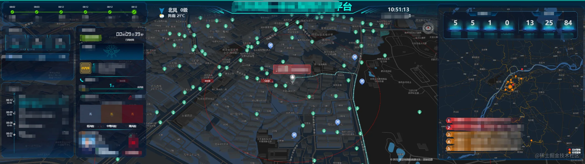
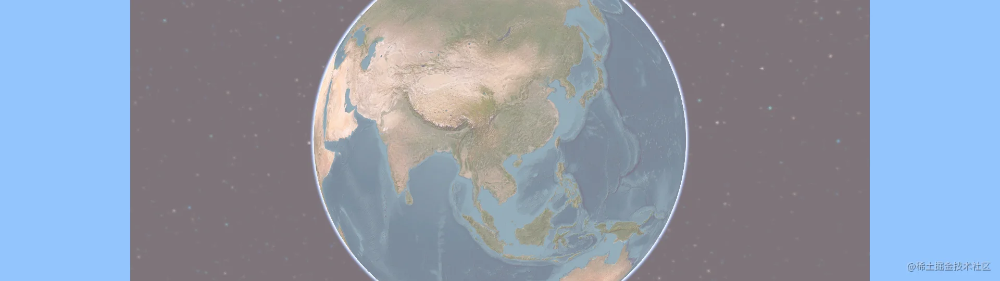
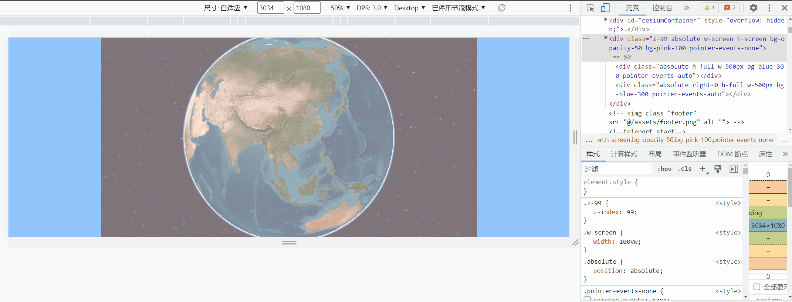

# 前言


在地图开发过程中，会遇到一些业务组件挂在地图上面，一般直接将其定位挂载就行了。但是如果布局比较复杂，组件比较多，一般会将其在Laytou.vue中统一管理，但这个时候会遇到，一个在左侧一个在右侧，盖在地图上的时候，遮挡住了地图的控制事件。
这里简单使用CSS [pointer-event](https://developer.mozilla.org/zh-CN/docs/Web/CSS/pointer-events)解决这个问题。

## 解决

- 1. 整体布局背景组件添加 "pointer-events: none"
- 2. 单个的业务组件添加 "pointer-events: auto"

```html
<div
  class="z-99 absolute w-screen h-screen bg-opacity-50 bg-pink-100 pointer-events-none"
>
  <div
    class="absolute h-full w-500px bg-blue-300 pointer-events-auto"
    @click="clickLeft"
  />
  <div
    class="absolute right-0 h-full w-500px bg-blue-300 pointer-events-auto"
    @click="clickRight"
  />
</div>
```



"pointer-events: none" ： 元素永远不会成为鼠标事件的[target(en-US)](https://developer.mozilla.org/en-US/docs/Web/API/Event/target 'Currently only available in English (US)')。但是，当其后代元素的`pointer-events`属性指定其他值时，鼠标事件可以指向后代元素，在这种情况下，鼠标事件将在捕获或冒泡阶段触发父元素的事件侦听器。

"pointer-events: auto" ： 与`pointer-events`属性未指定时的表现效果相同



全部代码：

```vue
<script setup lang="ts">
import { setupCesiumMap } from '@/utils'
onMounted(() => {
  // 挂载地图
  setupCesiumMap()
})
function clickLeft() {
  alert('点击了左边')
}
function clickRight() {
  alert('点击了右边')
}
</script>

<template>
  <div id="cesiumContainer" />
  <div class="pointer-events-none absolute z-99 h-screen w-screen bg-pink-100 bg-opacity-50">
    <div class="pointer-events-auto absolute h-full w-500px bg-blue-300" @click="clickLeft" />
    <div class="pointer-events-auto absolute right-0 h-full w-500px bg-blue-300" @click="clickRight" />
  </div>
</template>

<style lang="less">
#cesiumContainer {
  position: absolute;
  padding: 0px;
  margin: 0px;
  width: 100vw;
  height: 100vh;
}
</style>
```
