## 前言

昨天使用 [P5.js创建纸质背景的时候](https://juejin.cn/post/7184721244351103037)，使用`bezier()`这个函数的时候，浏览P5.js中文文档 [bezier()](https://p5js.org/zh-Hans/reference/#/p5/bezier)，发现其对参数的描述有一些错误（翻译描述错误）。于是便开始了俺第一次提交PR的过程，并在第二天合进了主分支，还被添加进[contributors](https://github.com/processing/p5.js/blob/main/README.md#contributors)墙上😁。

## 提Issue

🐱‍🚀 第一步也是很重要的一步，查看一下这个问题别人是不是已经提了，又或者已经修改好了。于是俺首先在[P5.js仓库](https://github.com/processing/p5.js-website/issues)查了一下，发现并没有人有过这方面的提交。嘻嘻，俺的第一次要来了。

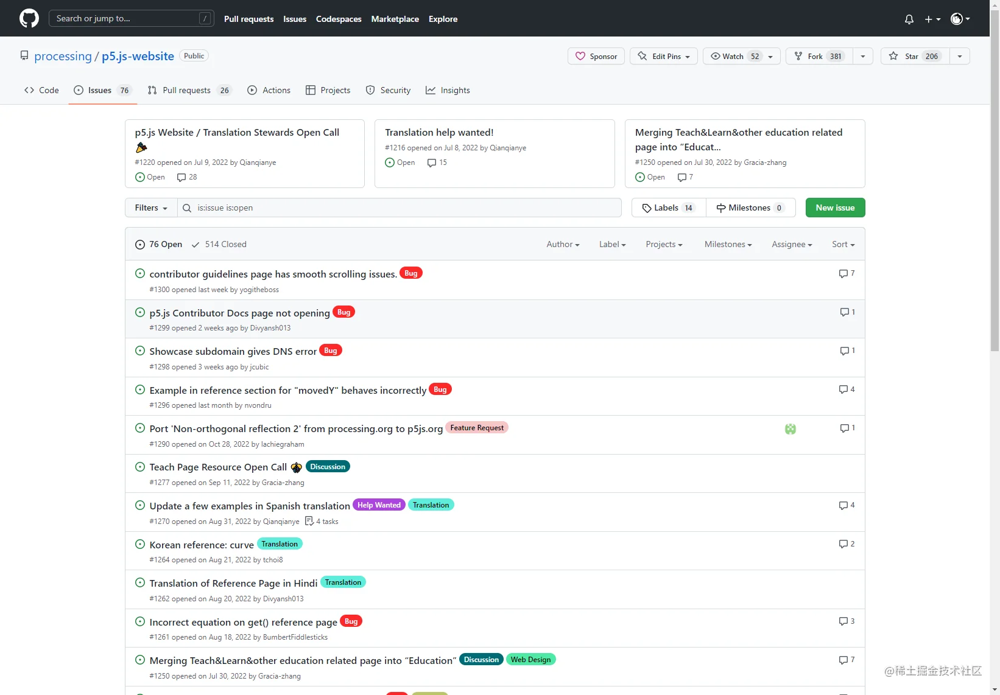

🍔 第二步就是创建Issue！！

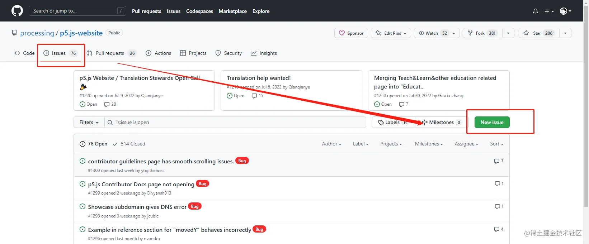

绿色小按钮`New Issue`似乎有着无穷的魔力吸引着我，点击！！！

然后就来到了仓库设置的Issue提交规范，这里是俺的问题是中文翻译问题，那自然就点击了 **Improve Translation**。

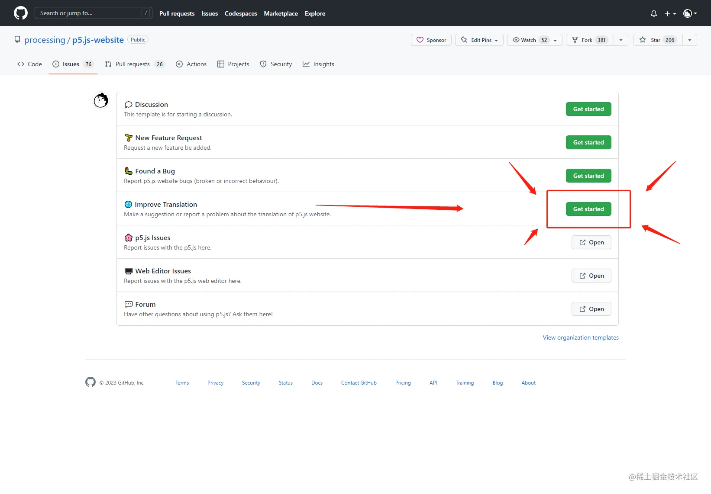

然后来到了提交Issue的正式环节，填写内容。

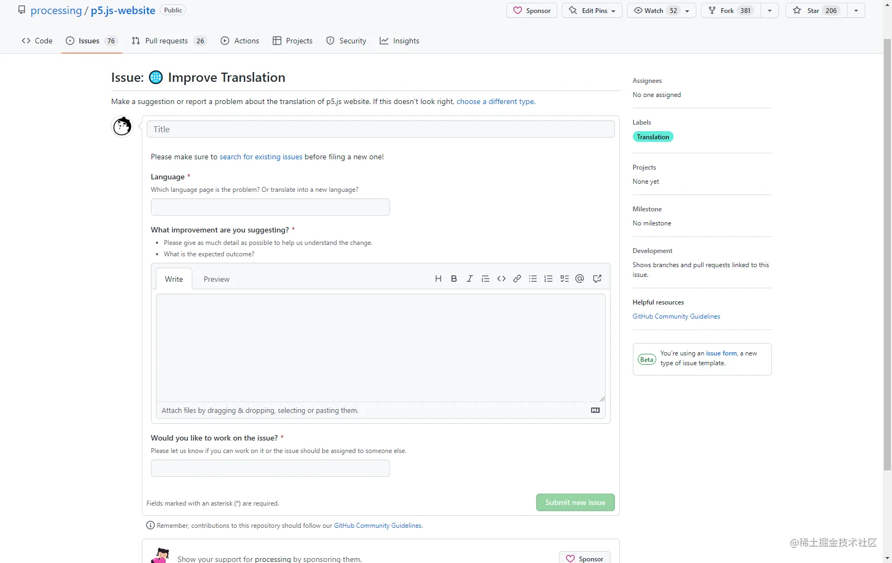

我之前已经提交过了，这里就不再重新填写，将填好的内容放上来看看。

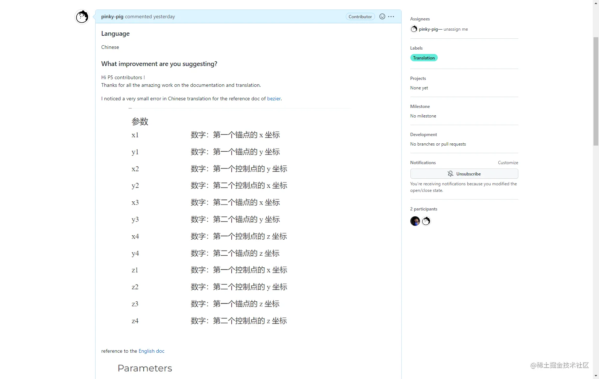

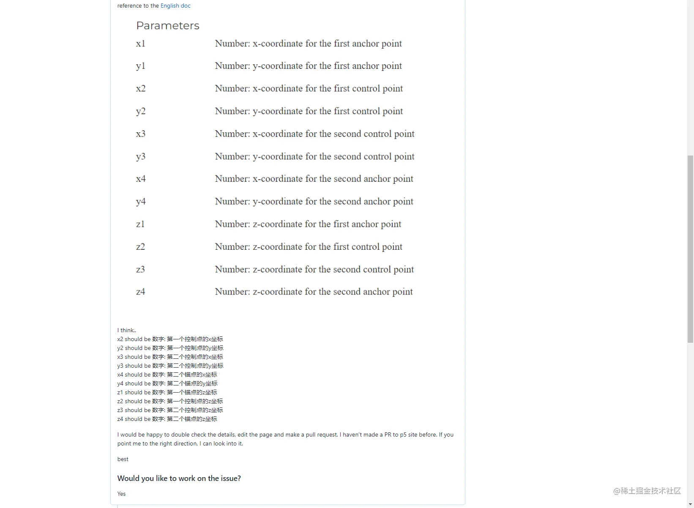

填写完之后，点击绿色小按钮 `Submit new issure` ，提交~~

到这里就提交成功了，俺的这个 [Issue](https://github.com/processing/p5.js-website/issues/1301)

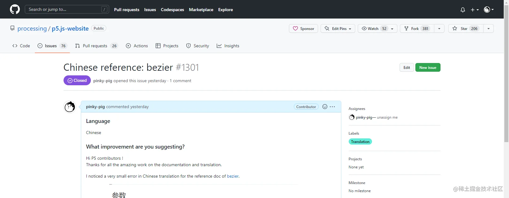

## Fork仓库，commit修改内容

我在上午提了 Issue 后，差不多晚上七八点的时候，邮箱收到了 Github 的通知，提的Issue有人处理了。于是就打开Github，看到了下面。

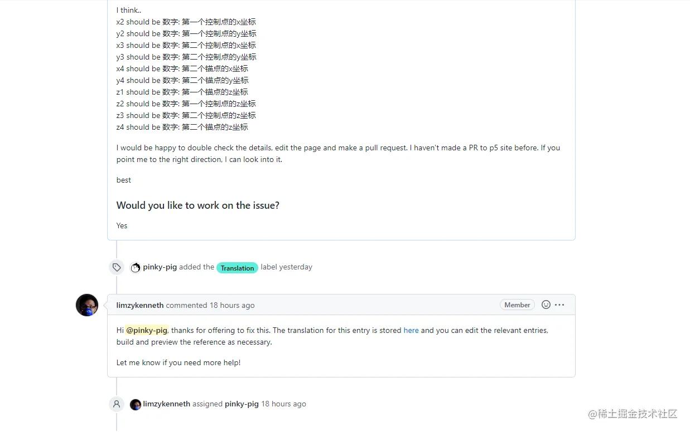

嘿嘿，告诉了我要修改的文件地址，并且说给我分配了权限，那这就开干。

🚀 第一步，fork仓库。

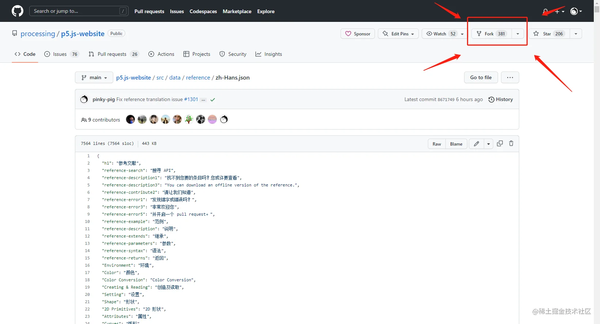

🚠 第二步，进入自己刚fork的仓库里，因为我这里只是翻译描述错误，所以就不需要本地download代码，运行测试了，直接根据Issue反馈的路径找到文件内容，修改！！！

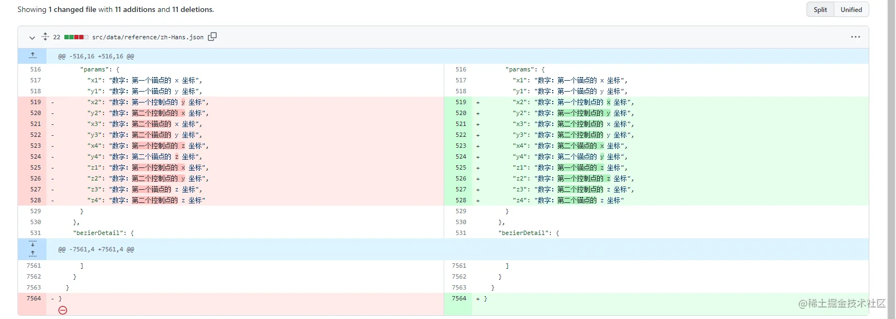

这里修改好了之后，需要仔细看看P5.js的[提交规范](https://github.com/processing/p5.js-website)再提交。

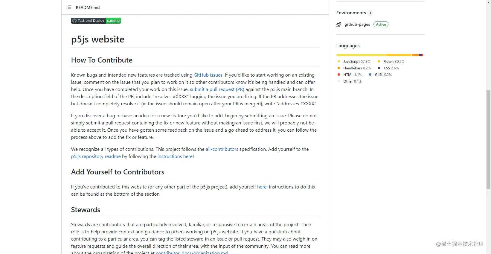

于是，俺很诚恳地写下了如下的 commit 描述🤣。

```
title:
Fix reference translation issue[processing#1301](https://github.com/processing/p5.js-website/issues/1301)
description:
resolves [processing#1301](processing#1301)
Improve translation for the reference doc of bezier.
This is my first PR. If I have any mistakes, please point me to the right direction, I can look into it and correct it.
```

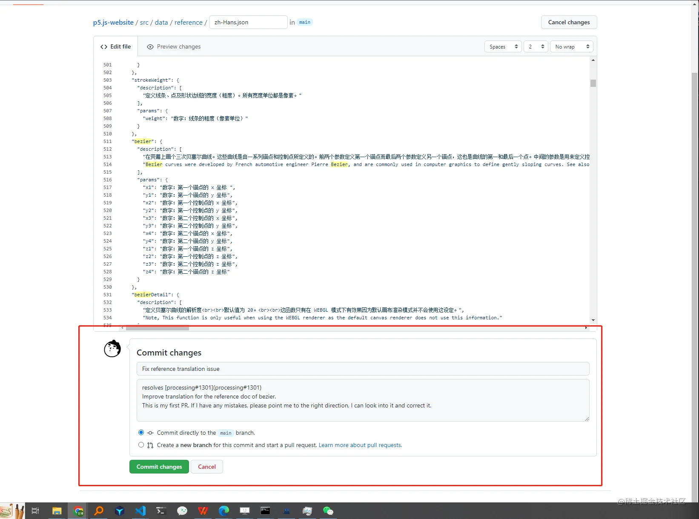

## 提交PR

上面已经将要修改的内容提交到了自己的仓库吗，接下来就是准备要提交到项目中~

🍔 第一步，创建 `New pull request`。

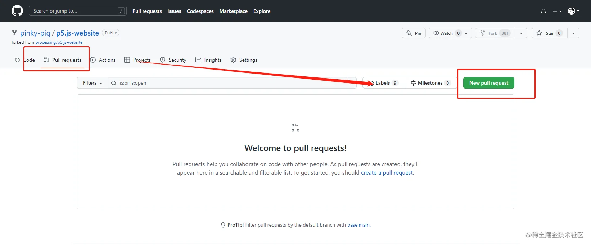

🍟 第二步，检查更改的内容，没问题的话，就创建PR！！
（这里的提交内容是为了记录，提交了一个空格）

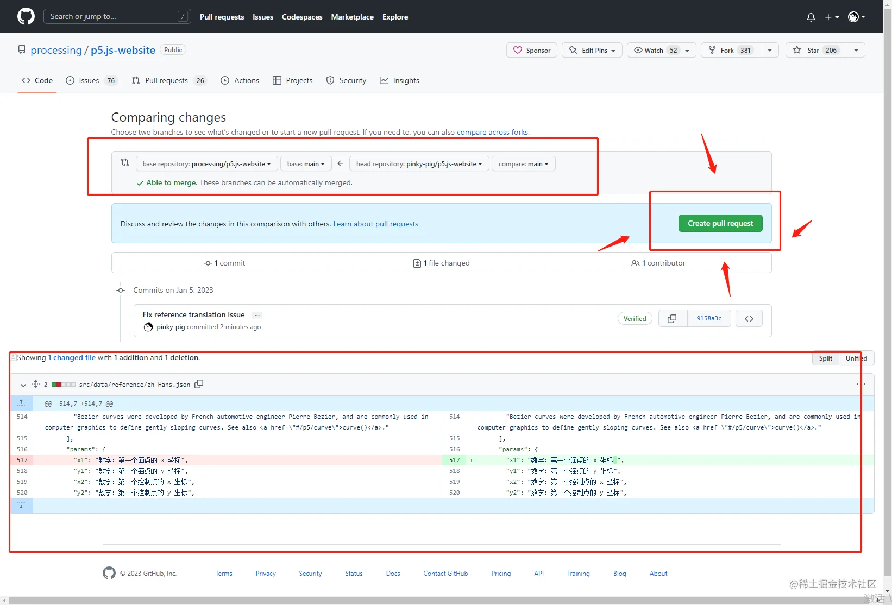

😁 这里就完成了PR的提交，静静等待仓库管理审核吧，整个流程十分简单~~

## 成为Contributor

第二天下午，收到了邮件提醒，我的提交已经被合进main分支了😘。然后我进入Github一看。

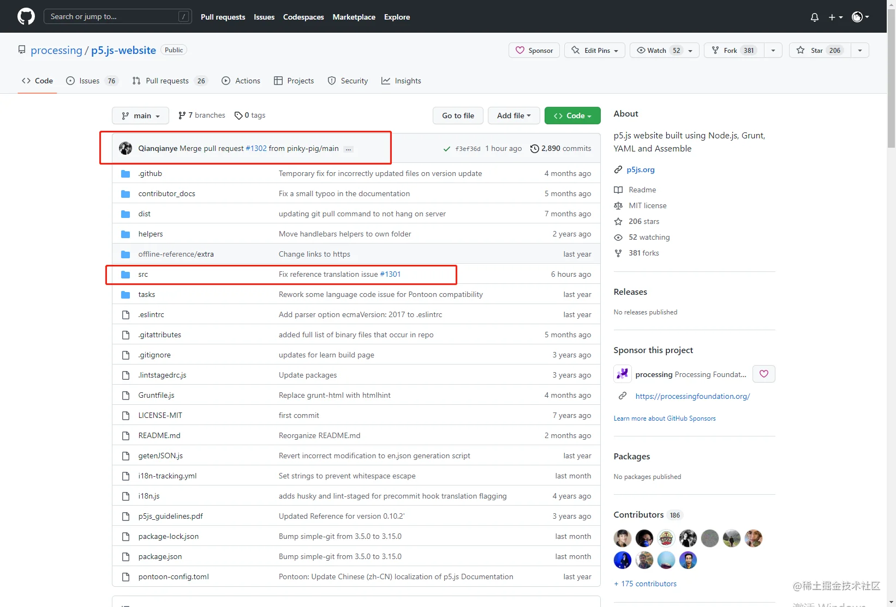

就是俺的commit description ~~

然后再去 [Contributor](https://github.com/processing/p5.js/blob/main/README.md#contributors) 墙上一看，俺的可爱小头像已经赫然在列😆

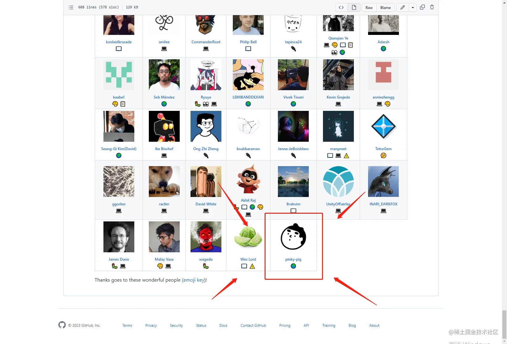

## 关闭Issue

既然已经解决了问题，那么上面提的Issue也可以关闭了，当然既可以管理员关闭，也可以你自己关闭，我这里直接自己关闭了。进入Issue，翻到最底部，点击**Close issue**，即可关闭。关闭之后，也可以重新打开`Reopen`或者评论`comment`。

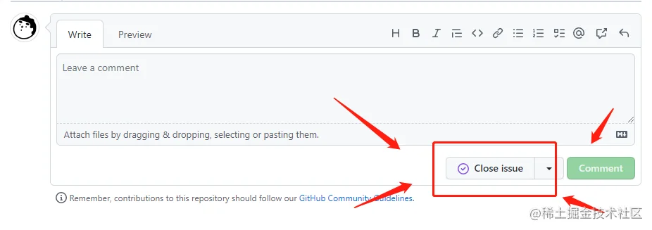

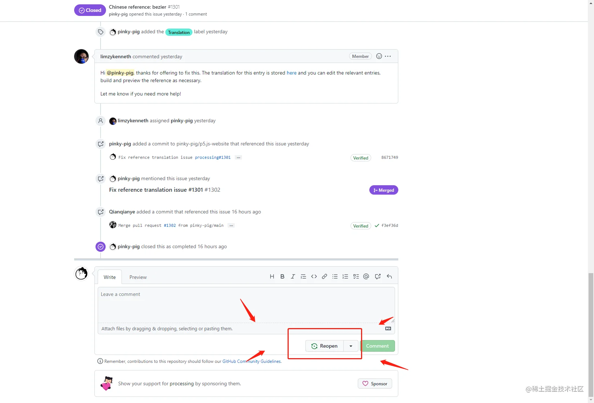

## 尾言

就这样，俺的第一次提交PR圆满结束，成为了一名 P5.js 的贡献者，很是骄傲呢！！
