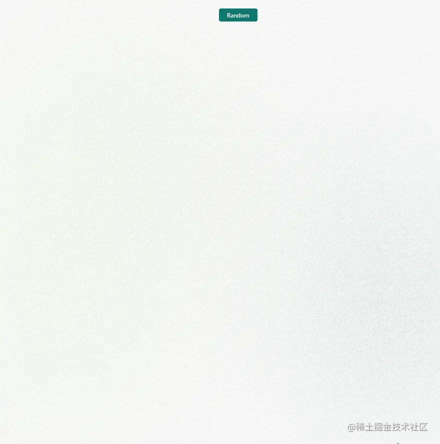
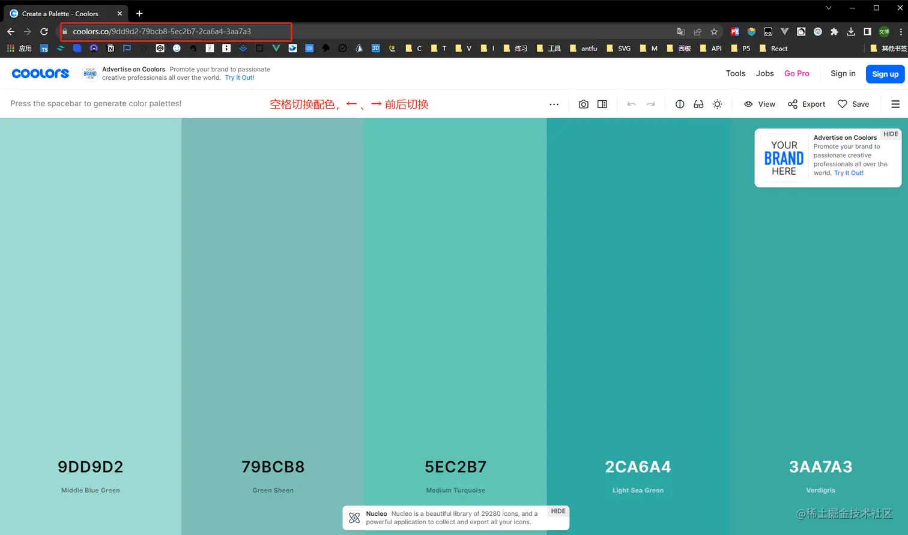
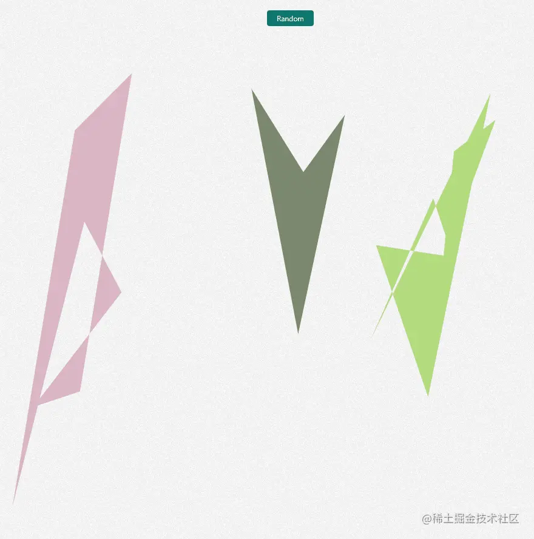
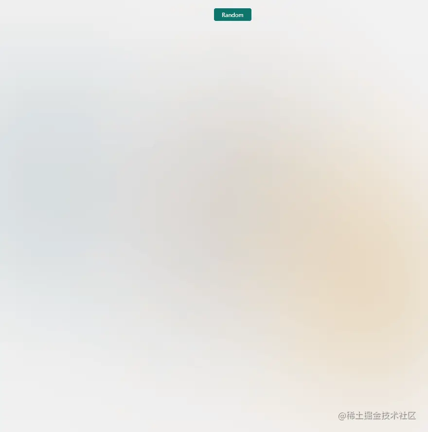
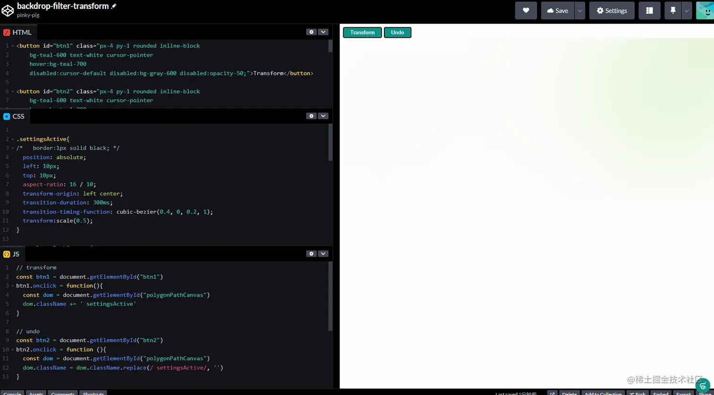

> 更新： 2023/01/11 - Svg滤镜实现

# 前言

看到了coco姐的这篇文章[妙用滤镜构建高级感拉满的磨砂玻璃渐变背景](https://juejin.cn/post/7057330357556740127)，于是自己来尝试一下。不过这里没有使用CSS-doodle，而是简单的使用clip-path生成多边形。

# 思路

这里的思路只是简化版，左中右分为三部分，每个部分是一个多边形。这样就随机生成了三个颜色不一样形状不一样多边形。再在其上加上`backdrop-filter: blur(150px);`就达到了模糊背景。
实际这里可以多考虑一些，比如左中右每个部分的多边形个数、形状及颜色也随机一下，这样效果会更好一点，但是这里就只是一个简单版本。

## Random

构建随机函数，之前用P5.js，使用其Random函数很上手，比如在数组中随机，或者在指定范围中随机，又或者有seed，但是js中原生并没有提供这些方法，这里简单从**MDN**上拷了一个[得到一个两数之间的随机整数，包括边界值](https://developer.mozilla.org/zh-CN/docs/Web/JavaScript/Reference/Global_Objects/Math/random#%E5%BE%97%E5%88%B0%E4%B8%80%E4%B8%AA%E4%B8%A4%E6%95%B0%E4%B9%8B%E9%97%B4%E7%9A%84%E9%9A%8F%E6%9C%BA%E6%95%B4%E6%95%B0)。

```js
function getRandomIntInclusive(min: number, max: number) {
  min = Math.ceil(min)
  max = Math.floor(max)
  return Math.floor(Math.random() * (max - min + 1)) + min // 含最大值，含最小值
}
```

## 颜色

这里我在这个网站上找的配色[coolors](https://coolors.co/)，主要是看其方便拷贝色值，在其地址栏URL就有了色值组合，直接拿来用。



这是随便找的几个色彩组合。

```js
const themes = [
  '64a6bd-90a8c3-ada7c9-d7b9d5-f4cae0'.split('-').map(a => `#${a}`),
  '4059ad-6b9ac4-97d8c4-eff2f1-f4b942'.split('-').map(a => `#${a}`),
  'd1f0b1-b6cb9e-92b4a7-8c8a93-81667a'.split('-').map(a => `#${a}`),
  '7776bc-cdc7e5-fffbdb-ffec51-ff674d'.split('-').map(a => `#${a}`),
  '628395-96897b-dbad6a-cf995f-d0ce7c'.split('-').map(a => `#${a}`),
  '28536b-c2948a-7ea8be-f6f0ed-bbb193'.split('-').map(a => `#${a}`),
  'dcc48e-eaefd3-b3c0a4-505168-27233a'.split('-').map(a => `#${a}`),
  'dab6c4-7b886f-b4dc7f-feffa5-ffa0ac'.split('-').map(a => `#${a}`),
]
```

## Core

这里的核心代码其实很简单，就是随机三个图形，分别左中右各33%，然后每个图形的角的个数及坐标位置是随机的，然后就构成了三个不同的多边形，再给其加上随机颜色，就完事了。过多不再阐述，直接看代码就行，逻辑都在注释里。

```ts
function randomGeneratePolygon() {
  // 渲染几个多边形（这里只有3个）
  // eslint-disable-next-line unicorn/no-new-array
  const polygonList = new Array(getRandomIntInclusive(3, 3)).fill([])

  // 随机这几个多边形的颜色数组
  const polygonColorArray = getRandomIntInclusive(0, themes.length - 1)

  // 遍历每个多边形
  polygonPathList.value = polygonList.map((item, index) => {
    // 1.首先获取每个多边形随机的边数
  // eslint-disable-next-line unicorn/no-new-array
    const num = new Array(getRandomIntInclusive(3, 10)).fill([])

    // 2.然后计算每个角的坐标
    const coordinates = num.map((it) => {
      // 获取x坐标（这里三个图形各三分之一，所以使用三等分）
      const x = getRandomIntInclusive(100 / 3 * index, 100 / 3 * (index + 1))
      // 获取y坐标
      const y = getRandomIntInclusive(0, 100)

      return [`${x}%`, `${y}%`]
    })

    // 3.根据得到的坐标，生成clip-path字符串,n条边即是n个角,n个坐标,坐标范围要在画布最大最小的范围内
    let clipPathStr = ''
    coordinates.forEach((i) => {
      const str = `${i[0]} ${i[1]},`
      clipPathStr += str
    })

    return {
      path: `polygon(${clipPathStr.slice(0, clipPathStr.length - 1)})`,
      color: themes[polygonColorArray][index],
    }
  })
}
```

## Dom

这里是Vue思路，v-for三个图形，尺寸全百分之百，父相子绝，因为在上面其位置已经控制了每个元素各三分之一，所以这里也不会重叠。

```html
<div class="polygonPath w-full h-full relative">
  <div
    v-for="item, index in polygonPathList"
    :key="index"
    class="w-full h-full absolute top-0 left-0"
  >
    <div
      class="w-full h-full"
      :style="{ clipPath: item.path, background: item.color }"
    />
  </div>
</div>
```

## Backdrop-filter

上面几步操作以及完成了百分之九十，已经达到了随机生成三个不同颜色的多边形，如下所示。



这里我们加一个 `backdrop-filter`就能使背景模糊了~~

```css
.polygonPath::before {
  content: '';
  position: fixed;
  top: 0;
  left: 0;
  bottom: 0;
  right: 0;
  backdrop-filter: blur(150px);
  z-index: 1;
}
```

看看效果⭐



甚至还可以再加一个噪声图片处理一下，让其更加模糊🤡，参考这个[Codepen](https://codepen.io/pinky-pig/pen/ZEjzzpX)，只是新增一句`background-image: url(https://arc.net/noise.png);`

看看效果🍔


## 全部代码

```vue
<script setup lang="ts">
const polygonPathList = ref()

const themes = [
  '64a6bd-90a8c3-ada7c9-d7b9d5-f4cae0'.split('-').map(a => `#${a}`),
  '4059ad-6b9ac4-97d8c4-eff2f1-f4b942'.split('-').map(a => `#${a}`),
  'd1f0b1-b6cb9e-92b4a7-8c8a93-81667a'.split('-').map(a => `#${a}`),
  '7776bc-cdc7e5-fffbdb-ffec51-ff674d'.split('-').map(a => `#${a}`),
  '628395-96897b-dbad6a-cf995f-d0ce7c'.split('-').map(a => `#${a}`),
  '28536b-c2948a-7ea8be-f6f0ed-bbb193'.split('-').map(a => `#${a}`),
  'dcc48e-eaefd3-b3c0a4-505168-27233a'.split('-').map(a => `#${a}`),
  'dab6c4-7b886f-b4dc7f-feffa5-ffa0ac'.split('-').map(a => `#${a}`),
]
function getRandomIntInclusive(min: number, max: number) {
  min = Math.ceil(min)
  max = Math.floor(max)
  return Math.floor(Math.random() * (max - min + 1)) + min // 含最大值，含最小值
}
function randomGeneratePolygon() {
  // 渲染几个多边形（这里只有3个）
  // eslint-disable-next-line unicorn/no-new-array
  const polygonList = new Array(getRandomIntInclusive(3, 3)).fill([])

  // 随机这几个多边形的颜色数组
  const polygonColorArray = getRandomIntInclusive(0, themes.length - 1)

  // 遍历每个多边形
  polygonPathList.value = polygonList.map((item, index) => {
    // 1.首先获取每个多边形随机的边数
  // eslint-disable-next-line unicorn/no-new-array
    const num = new Array(getRandomIntInclusive(3, 10)).fill([])

    // 2.然后计算每个角的坐标
    const coordinates = num.map((it) => {
      // 获取x坐标（这里三个图形各三分之一，所以使用三等分）
      const x = getRandomIntInclusive(100 / 3 * index, 100 / 3 * (index + 1))
      // 获取y坐标
      const y = getRandomIntInclusive(0, 100)

      return [`${x}%`, `${y}%`]
    })

    // 3.根据得到的坐标，生成clip-path字符串,n条边即是n个角,n个坐标,坐标范围要在画布最大最小的范围内
    let clipPathStr = ''
    coordinates.forEach((i) => {
      const str = `${i[0]} ${i[1]},`
      clipPathStr += str
    })

    return {
      path: `polygon(${clipPathStr.slice(0, clipPathStr.length - 1)})`,
      color: themes[polygonColorArray][index],
    }
  })
}

randomGeneratePolygon()
</script>

<template>
  <button class="absolute z-10 btn" @click="randomGeneratePolygon()">
    Random
  </button>
  <div class="polygonPath relative h-full w-full">
    <div v-for="item, index in polygonPathList" :key="index" class="absolute left-0 top-0 h-full w-full">
      <div class="h-full w-full" :style="{ clipPath: item.path, background: item.color }" />
    </div>
  </div>
</template>

<style scoped>
.polygonPath::before {
  content: '';
  position: fixed;
  top: 0;
  left: 0;
  bottom: 0;
  right: 0;
  backdrop-filter: blur(150px);
  z-index: 1;
  background-image: url(https://arc.net/noise.png);
}
</style>
```

## Svg滤镜实现

上述虽然已经实现了，但是filter属性需要浏览器的支持度较高，比如火狐浏览器就不支持这个。而且我再实际开发过程中，还遇到了比如给其添加`border:1px solid black;`，其也会模糊，效果非常不好；还有若再在border的基础上给其添加transform动画的时候，其会有闪烁效果，影响更加不好了。



针对`backdrop-filter`浏览器支持度的问题，查阅文档的时候，看到张鑫旭老师的文章，火狐浏览器可以使用Svg滤镜实现。

> 我的codepen代码实现： https://developer.mozilla.org/zh-CN/docs/Web/SVG/Element/feGaussianBlur
> 借助SVG滤镜实现CSS无法实现的阴影和模糊效果: https://www.zhangxinxu.com/wordpress/2021/07/svg-filter-shadow-css-blur/
> Svg毛玻璃Demo：https://www.zhangxinxu.com/study/202107/svg-backdrop-filter-blur-demo.php
> MDN上的Svg滤镜： https://developer.mozilla.org/zh-CN/docs/Web/SVG/Element/feGaussianBlur

代码效果可以查看我的[codepen](https://developer.mozilla.org/zh-CN/docs/Web/SVG/Element/feGaussianBlur)地址，主要思路就是创建一个svg，然后给要设置的要素设置`filter: url(#blur);`
