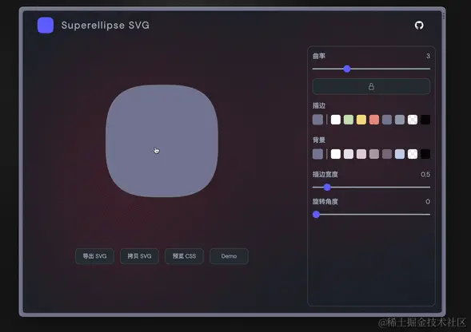
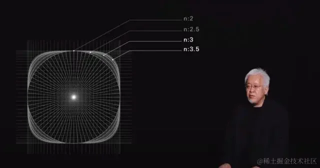
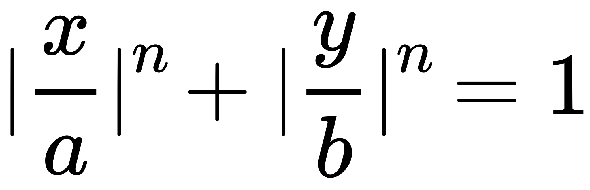
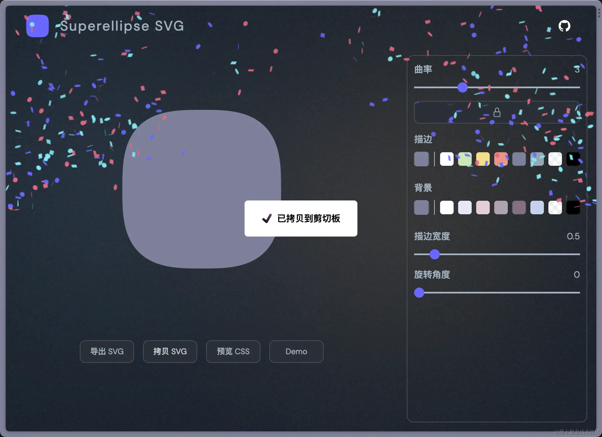
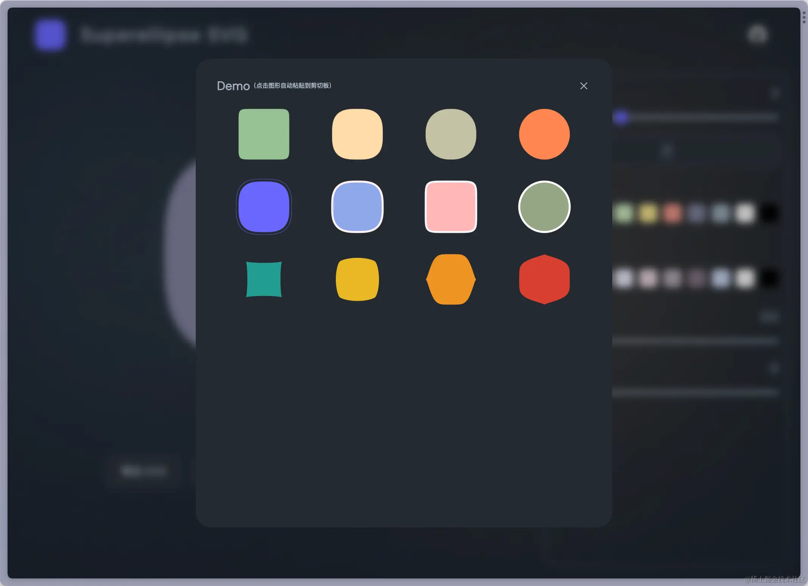

# 前言

第一次意识到超椭圆 Superellipse 的时候，就是小米的价值 200 万 Logo 。其圆角给人感觉很圆润，作为一名前端er，自然想能否用 CSS - border-radius 实现。后来尝试不行，才主动简单了解了一下超椭圆。

<p align="center">

  <svg xmlns="http://www.w3.org/2000/svg" width="32" height="32" viewBox="0 0 24 24">
    <path
      fill="#FF6800"
      d="M12 0C8.016 0 4.756.255 2.493 2.516C.23 4.776 0 8.033 0 12.012c0 3.98.23 7.235 2.494 9.497C4.757 23.77 8.017 24 12 24c3.983 0 7.243-.23 9.506-2.491C23.77 19.247 24 15.99 24 12.012c0-3.984-.233-7.243-2.502-9.504C19.234.252 15.978 0 12 0zM4.906 7.405h5.624c1.47 0 3.007.068 3.764.827c.746.746.827 2.233.83 3.676v4.54a.15.15 0 0 1-.152.147h-1.947a.15.15 0 0 1-.152-.148V11.83c-.002-.806-.048-1.634-.464-2.051c-.358-.36-1.026-.441-1.72-.458H7.158a.15.15 0 0 0-.151.147v6.98a.15.15 0 0 1-.152.148H4.906a.15.15 0 0 1-.15-.148V7.554a.15.15 0 0 1 .15-.149zm12.131 0h1.949a.15.15 0 0 1 .15.15v8.892a.15.15 0 0 1-.15.148h-1.949a.15.15 0 0 1-.151-.148V7.554a.15.15 0 0 1 .151-.149zM8.92 10.948h2.046c.083 0 .15.066.15.147v5.352a.15.15 0 0 1-.15.148H8.92a.15.15 0 0 1-.152-.148v-5.352a.15.15 0 0 1 .152-.147Z"
    >
    </path>
  </svg>

</p>

原研哉采用的就是 `n = 3` 的超椭圆。



而后再去观察日常生活的最常见的超椭圆可能就是各个手机系统的图标了，很多都是应用的超椭圆，只是 n 的值可能不太一样。

**超椭圆**的定义可以参考下面这个：

> 是在[笛卡儿坐标系](https://zh.wikipedia.org/wiki/%E7%AC%9B%E5%8D%A1%E5%84%BF%E5%9D%90%E6%A0%87%E7%B3%BB '笛卡儿坐标系')下满足以下方程式的点的集合：
>
> 

> 其中*n*、*a*及*b*为正数。这里设置 a b 的值都为 1 ，简化为 `|x|^n + |y|^n = 1`

# 实现功能

- [√] 设置曲率 N 值
- [√] 设置 stroke fill color
- [√] 设置 stroke width
- [√] 设置 rotate
- [√] SVG code
- [√] 导出 SVG
- [√] 彩带效果
- [√] CSS Background Code
- [√] 预设超椭圆 Demo
- [√] 小彩蛋，（点击中间预览 SVG 随机 ｜ 按下键盘空格 ）更换背景色。





# 核心代码

```ts
async function getSuperellipsePath(
  a = 50, // X 轴半径
  b = 50, // Y 轴半径
  nX = 4, // X 轴幂指数
  nY = 4, // Y 轴幂指数
  steps = 360, // 点的个数
) {
  // 计算超椭圆的路径点
  const nX2 = 2 / nX
  const nY2 = 2 / nY
  const points = await Array.from({ length: steps }, (_, i) => {
    const t = (i * 2 * Math.PI) / steps
    const cosT = Math.cos(t)
    const sinT = Math.sin(t)
    const x = Math.abs(cosT) ** nX2 * a * Math.sign(cosT)
    const y = Math.abs(sinT) ** nY2 * b * Math.sign(sinT)
    return { x, y }
  })
  return `${points.map((p, i) => `${i === 0 ? 'M' : 'L'} ${p.x} ${p.y}`).join(' ')} Z`
}
```

# 在线预览

https://superellipse.mmeme.me/

# 代码仓库

https://github.com/pinky-pig/superellipse-svg

如果觉得还不错，求求大家点个 star 🌟 ，在这里磕头了🙇🙇🙇。
