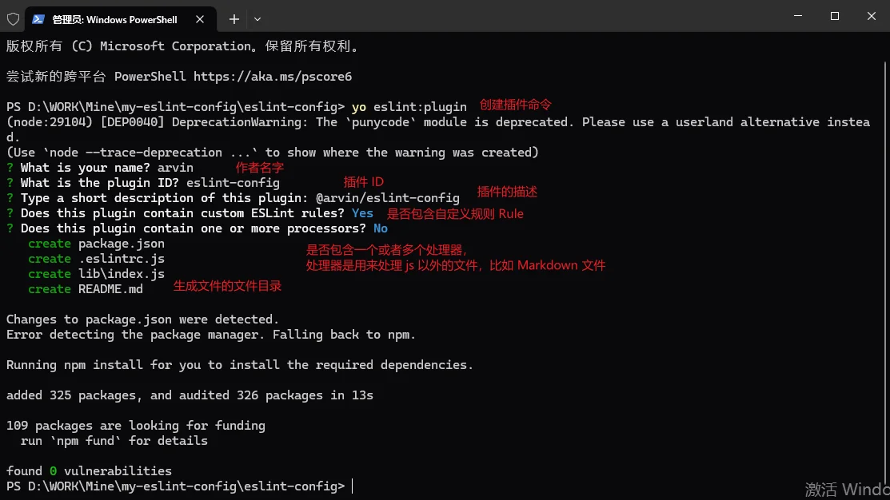
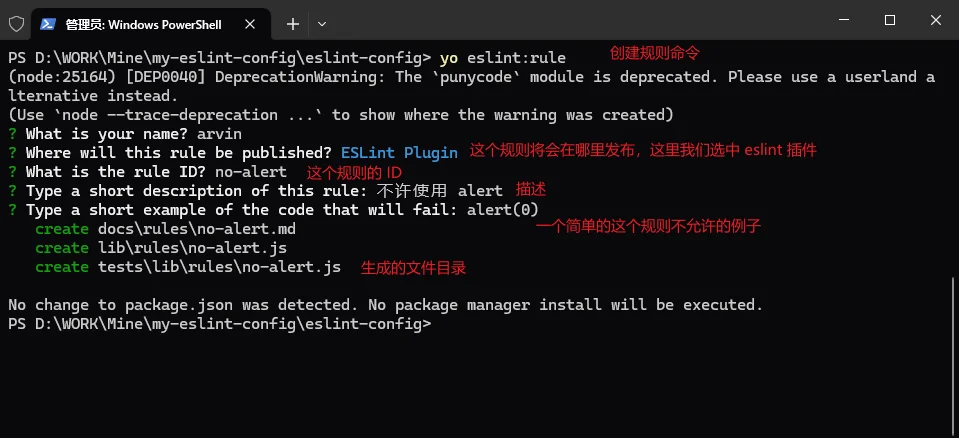
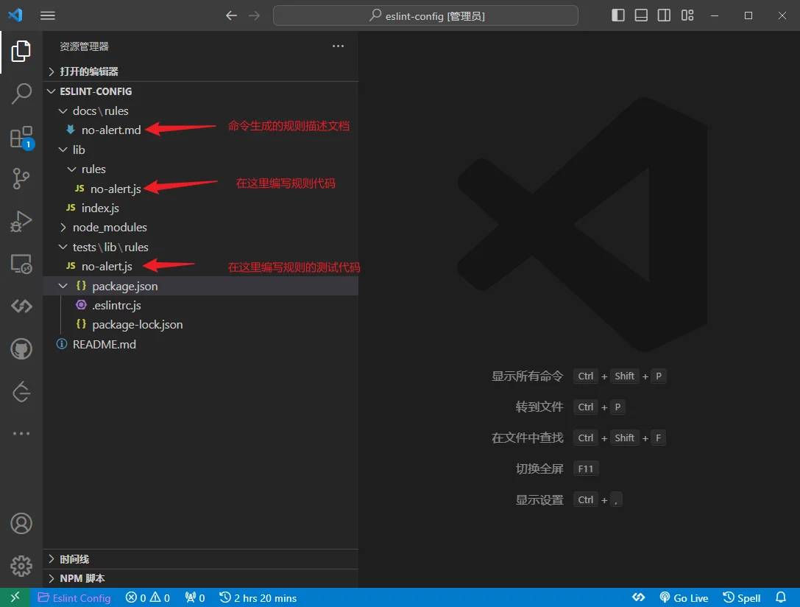
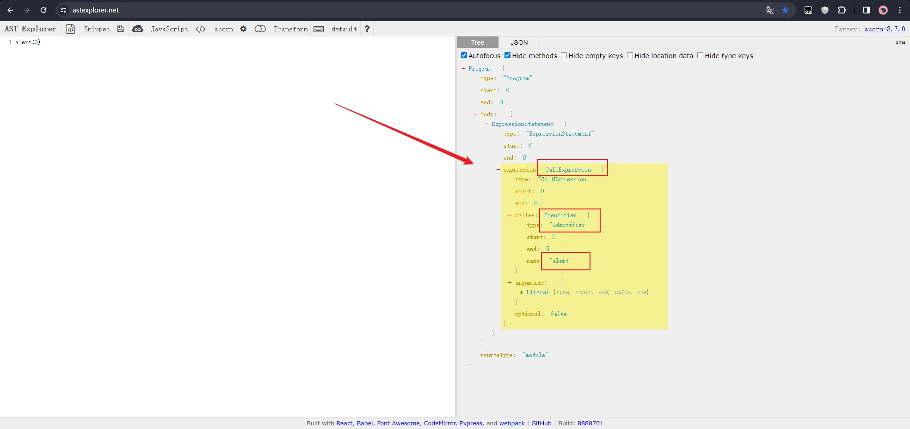
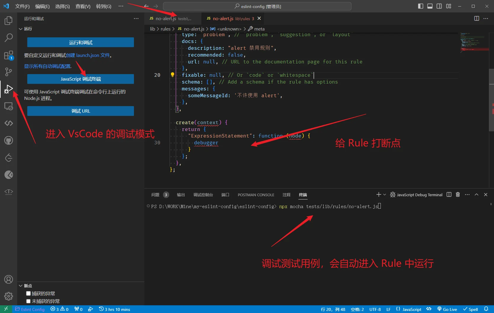
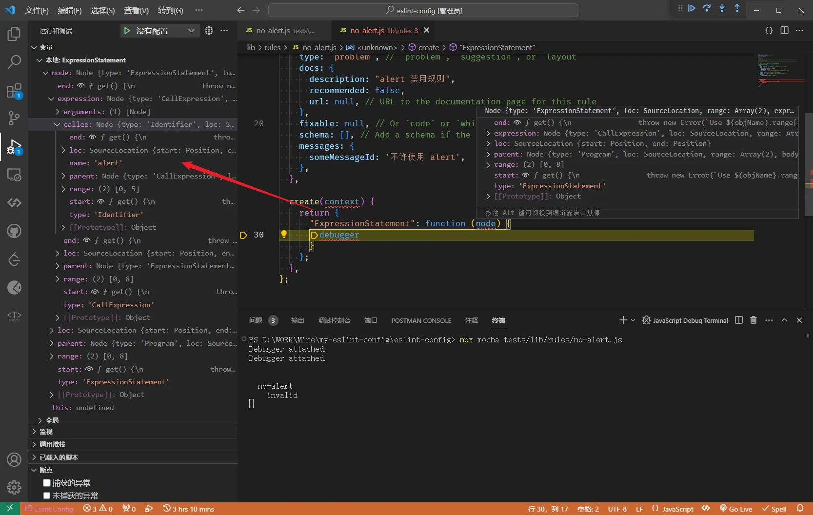
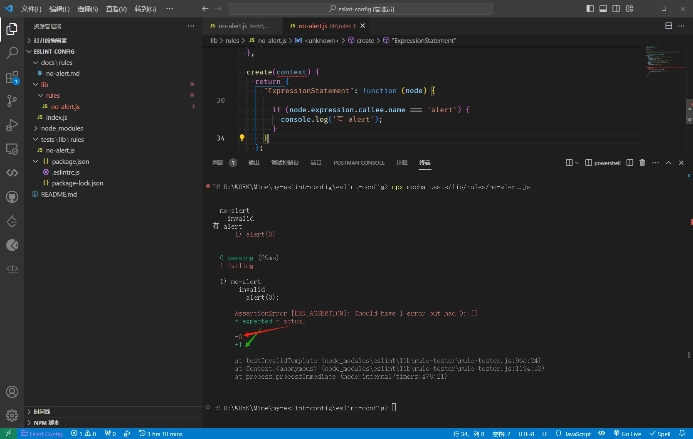
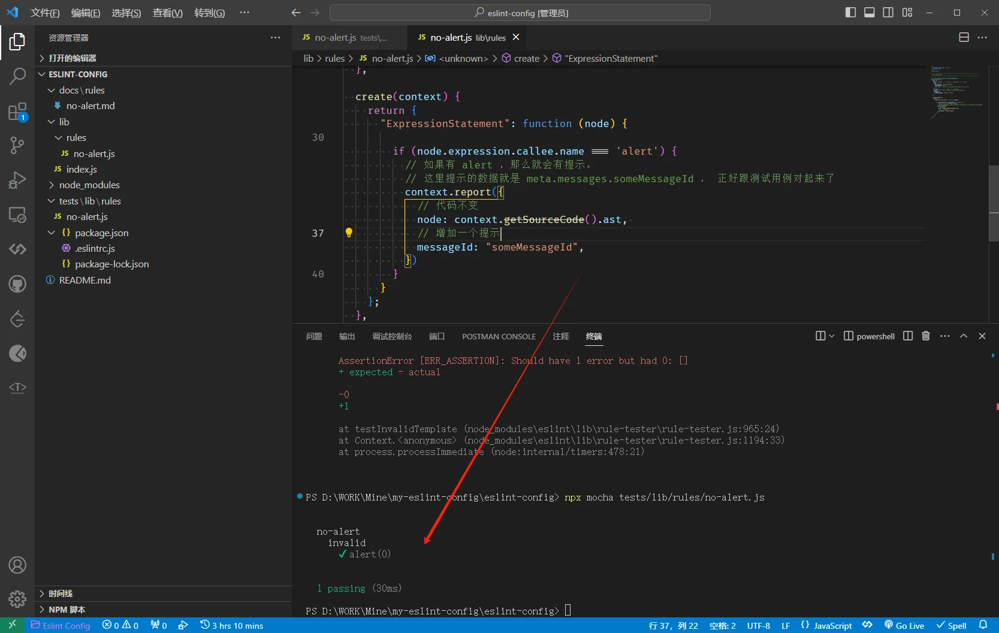
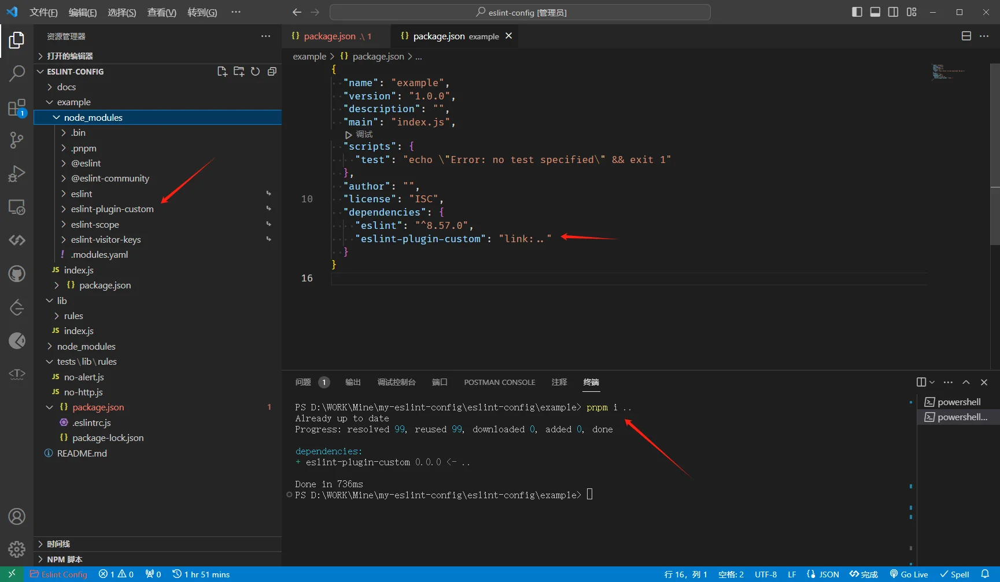

**`plugins`是一个插件，里面自己定义的规则（写法规则）和处理器（处理不同类型的文件）等等。**

> 1. [Eslint 官方中文文档 - 创建插件](https://zh-hans.eslint.org/docs/latest/extend/plugins#%E6%8F%92%E4%BB%B6%E5%91%BD%E5%90%8D)
> 2. [古茗前端实现自定义 ESLint 规则文章](https://juejin.cn/post/7202413628807938108)
> 3. [GitHub 实现 ESLint 插件文章参考](https://github.com/pfan123/Articles/issues/70)

下面创建最基础简单的规则作为样例。

Tips

- ESLint 默认对 js 进行处理，JSON 或其他格式的文件需要配置插件。
- 脚本命令

```json
"scripts": {
    "lint": "eslint .",
	"lint:fix": "eslint --fix --ext .js,.jsx ."
  },
```

- 重启 ESLint `Shift+Ctrl+P` + `ESLint: Restart ESLint Server`

## 🌸自定义 Rules

> [Yeoman 生成器](https://www.npmjs.com/package/generator-eslint) - 官方推荐使用的创建器

#### 1.安装脚手架依赖

```bash
npm i -g yo
npm i -g generator-eslint
yo eslint:plugin
yo eslint:rule
```

#### 2.创建插件包文件夹

```bash
mkdir eslint-config
cd eslint-config
```

#### 3.使用脚手架创建 Plugin 和 Rule

```bash
# 创建插件，会填一些配置项
yo eslint:plugin
# 创建规则，也会填一些配置项
yo eslint:rule
```

##### 使用 `yo eslint:plugin` 创建插件:



a. 使用 `VsCode` 打开文件夹

```bash
code .
```

b. 打开 `package.json` 更改一下 `name` 和 `description`。
这里的名字需要 eslint-config 开头。

```json
{
  "name": "eslint-plugin-custom",
  "version": "0.0.0",
  "description": "arvin's eslint-config"
}
```

c. 文件目录介绍

- `lib/rules` 文件夹下写规则
- `lib/index.js` 规则导出及配置项
- `tests/lib/rules` 文件夹下写测试

##### 使用 `yo eslint:rule` 创建规则:



a. 生成的文件目录



b. 打开要开发的规则文件代码看看

发现报红色提示

```
`meta.messages` must contain at least one violation message.eslint[eslint-plugin/prefer-message-ids](https://github.com/eslint-community/eslint-plugin-eslint-plugin/tree/HEAD/docs/rules/prefer-message-ids.md)
```

其实就是缺少 `message` 提示，到打开*提示*的链接，到官网拷贝代码过来就好了。

c. 开始编写测试用例代码

```js
/**
 * @fileoverview 不许使用 alert
 * @author arvin
 */
'use strict'

// ------------
// 引入规则
// ------------
const rule = require('../../../lib/rules/no-alert')
const RuleTester = require('eslint').RuleTester

// ------------------------------------------------------------------------------
// 测试
// ------------------------------------------------------------------------------

const ruleTester = new RuleTester()

// ------------
// 引入提示信息，就是上一步引入的。这里其实随便写都可以，只要最后能过测试用例！
// ------------
const [MESSAGE_ID_DEFAULT] = Object.keys(rule.meta.messages)

ruleTester.run('no-alert', rule, {
  valid: [],
  invalid: [
    {
      code: 'alert(0)',
      errors: [{ messageId: MESSAGE_ID_DEFAULT }],
    },
  ],
})
```

d. 准备编写规则 Rule 代码
测试用例已经写了一个，`alert(0)`是报错的，接下来就是要在 Rule 代码中实现。



由上面AST分析器可知，alert会在这里触发。于是开始**调试代码**。其实在使用脚手架创建项目的时候，已经安装了调试代码的依赖，就是 `mocha` 这个包。

###### 调试代码

1. Vscode 进入调试 JS 模式
2. 打断点
3. 运行命令调试
4. 会发现变量跟上面 [astexplorer](https://astexplorer.net/) 的结构都一样，那么下面就好写了

打断点调试：


变量：


e. 继续开发 Rule 代码

```js
/**
 * @fileoverview 不许使用 alert
 * @author arvin
 */
'use strict'

// ------------------------------------------------------------------------------
// Rule Definition
// ------------------------------------------------------------------------------

/** @type {import('eslint').Rule.RuleModule} */
module.exports = {
  meta: {
    type: `problem`, // `problem`, `suggestion`, or `layout`
    docs: {
      description: 'alert 禁用规则',
      recommended: false,
      url: null, // URL to the documentation page for this rule
    },
    fixable: null, // Or `code` or `whitespace`
    schema: [], // Add a schema if the rule has options
    messages: {
      someMessageId: '不许使用 alert',
    },
  },

  create(context) {
    return {
      ExpressionStatement(node) {
        if (node.expression.callee.name === 'alert')
          console.log('有 alert')
      }
    }
  },
}
```

上面的代码已经完成了80%，运行测试用例，发现是报错的。查看报错信息，绿色是测试期待的输出，红色是实际输出不一致。我们知道测试期待的是有个 messageId 提示。



那么我们将代码改一下，再运行测试用例就会发现全部通过了。

```js
if (node.expression.callee.name === 'alert') {
  // 如果有 alert ，那么就会有提示。
  // 这里提示的数据就是 meta.messages.someMessageId ， 正好跟测试用例对起来了
  context.report({
    // 代码不变
    node: context.getSourceCode().ast,
    // 增加一个提示
    messageId: 'someMessageId',
  })
}
```



##### 再创建一条规则:

将变量赋值的 `http` 使用 `https` 替换。
有了上面的编码经验，这次就快很多了。

测试用例：

```js
/**
 * @fileoverview 使用 http 替代 https
 * @author arvin
 */
'use strict'

const rule = require('../../../lib/rules/no-http')
const RuleTester = require('eslint').RuleTester

const [MESSAGE_ID_DEFAULT] = Object.keys(rule.meta.messages)

const ruleTester = new RuleTester({ parserOptions: { ecmaVersion: 6 } })
ruleTester.run('no-http', rule, {
  valid: [
    {
      code: 'const server = \'https://127.0.0.1\' \r const server1 = \'https://127.0.0.1\'',
    },
  ],

  invalid: [
    {
      code: 'const server = \'http://127.0.0.2\'',
      output: 'const server = \'https://127.0.0.2\'',
      errors: [{ messageId: MESSAGE_ID_DEFAULT }],
    },
  ],
})
```

规则：

```js
/**
 * @fileoverview 使用 http 替代 https
 * @author arvin
 */
'use strict'

/** @type {import('eslint').Rule.RuleModule} */
module.exports = {
  meta: {
    type: `problem`, // `problem`, `suggestion`, or `layout`
    docs: {
      description: '不许使用 http',
      recommended: false,
      url: null, // URL to the documentation page for this rule
    },
    fixable: `code`, // Or `code` or `whitespace`
    schema: [], // Add a schema if the rule has options
    messages: {
      someMessageId: '使用 https 替代 http',
    },
  },

  create(context) {
    return {
      VariableDeclaration(node) {
        const originalValue = node.declarations[0].init.raw
        if (originalValue && originalValue.includes('http') && !originalValue.includes('https')) {
          context.report({
            node,
            messageId: 'someMessageId',
            fix: () => {
              const startPosition = node.declarations[0].init.range[0]
              const endPosition = node.declarations[0].init.range[1]
              return {
                range: [startPosition, endPosition],
                text: originalValue.replace('http', 'https')
              }
            },
          })
        }
      }
    }
  },
}
```

跑测试用例的方法也是跟上面的一样，直接跑通。

以上，就是开发自定义规则的步骤，是很简单的，接下来就是如何应用自己开发的插件。

## 🌸在项目中使用自定义插件

上面开发的插件如何使用，首先，自然是可以发 npm 包，然后下载使用。但因为我们还是在测试阶段，所以这里自然不太好直接就发包。

### 1. 新建一个空项目

- 刚才的文件夹根目录，新建一个文件夹
- 进入文件夹 `npm init`
- 安装 `eslint` - `pnpm i eslint`
- 安装刚才的依赖包 - `pnpm i ..`

这个时候会发现 package.json 中多了一个 `"custom-eslint": "link:.."` ,而且往 node_modules 中查找 ，发现有刚才自定义的插件文件夹，这就说明自定义的插件包安装成功了。



既然已经安装成功，那么接下来就是如何应用了。

- 在根目录新建文件 `.eslintrc.cjs` 并写入如下代码

```js
module.exports = {
  root: true,
  env: { es6: true },
  plugins: ['custom'], // 将插件名称添加到 plugins 数组中
  rules: {
    'custom/no-http': ['error'],
    'custom/no-alert': ['error'],
  }
}
```

然后可能需要重启一下 eslint

- ctrl + p
- `> Eslint: Restart ESLint Server`

新建一个测试文件 `index.js` 并写入：

```js
alert(11)
const server = 'http://127.0.0.2'
```

如果报红，鼠标 hover 查看是否有自己写的信息提示，如果有的话就说明自定义的规则生效了，保存会自动将`const server = 'http://127.0.0.2'` 更改为 `const server = 'https://127.0.0.2'`

### 2. 简化使用的时候的配置

上面这样使用有个不方便的是，既然已经开发了插件，为何还是需要在项目中引入 plugin 的时候，还需要在下面的 rule 中开启。

下面就简化配置。

1. 开发规则 `lib\index.js` 导出的时候，除了导出 rule 外，另外设置 configs.recommended

```js
const requireIndex = require('requireindex')
const rules = requireIndex(`${__dirname}/rules`)
module.exports = {
  // rules是必须的
  rules,
  // 增加configs配置
  configs: {
    // 配置了这个之后，就可以在其他项目中像下面这样使用了
    // extends: ['plugin:custom/recommended']
    recommended: {
      plugins: ['custom'],
      rules: {
        'custom/no-http': ['error'],
      }
    }
  }
}
```

这里的 recommended 就是可以在使用的时候直接继承使用插件的默认设置，不需要再次设置其是否开启。当然也可以设置覆盖。

2. 在使用项目中，这样配置

```js
module.exports = {
  root: true,
  env: { es6: true },
  plugins: ['custom'],
  extends: ['plugin:custom/recommended'],
}
```

这样就可以直接使用了，先引入插件，后继承使用规则。

## 🌸 其他

1. 使用 [eslint-define-config](https://www.npmjs.com/package/eslint-define-config) 提供配置的提示，更简单的配置。

```js
const { defineConfig } = require('eslint-define-config')

module.exports = defineConfig({
  root: true,
  env: { es6: true },
  plugins: ['custom'],
  extends: 'plugin:custom/recommended',
})
```

2. 定义成 monorepo 项目

> [参考文档](https://fe.okki.com/post/6195ac76f8fef82d58b3f720)

- packages/eslint-config 是根配置，用于导出自己的配置
- eslint-plugin 是自己定义的插件
- eslint-config-vue 是自己的 vue eslint配置
- eslint-config-react（eslint-config-xx）同理
- 在跟项目中的 .eslintrc.cjs 可以直接引入 eslint-config 作为自己的 eslint 配置。在 monorepo 项目中，根配置引入 eslint-config ，eslint-config 引入了其它包，但是要是想生效，需要在根目录将 eslint-config 和 eslint-plugin 或者其他包都安装。

比如根目录 .eslintrc.cjs ：

```json
"devDependencies": {
	"@arvin/eslint-plugin": "workspace:^",
	"@arvin/eslint-config": "workspace:^"
}
```

monorepo 项目结构：

```
esling-config
├─ fixtures // 示例项目
│    ├─ vue // 在 vue 项目中使用自己的 eslint 配置
│    └─ react // 同上
├─ node_modules
├─ packages
│    └─ eslint-config
│           ├─ index.js
│           ├─ package.json
│           └─ README.md
│    └─ eslint-plugin
│           ├─ docs
│           ├─ rules
│           ├─ tests
│           ├─ index.js
│           ├─ package.json
│           └─ README.md
│    └─ eslint-plugin
├─ package.json
├─ package-lock.json
├─ .eslintrc.cjs
├─ .npmrc
├─ .pnpm-lock.yaml
├─ .pnpm-workspace.yaml
└─ README.md
```

3. 发包

这里使用 [bumpp](https://github.com/antfu/bumpp) 快速修改版本号发包

```json
"scripts": {
    "release": "bumpp -c \"release: v%s\" package.json packages/*/package.json && pnpm -r publish"
  },
```

也可以使用过滤，只发 packages 里面的包

```json
"scripts": {
    "release": "release:packages": "bumpp -c \"release: v%s\" package.json packages/*/package.json && pnpm -r --filter=./packages/* publish"
  }
```

- `bumpp -c \"release: v%s\" package.json packages/*/package.json` 是修改版本号，然后`commit tag push` 等操作。
- `pnpm -r publish` 递归 packages 内的文件目录，然后对每个子目录执行相同的操作，publish 。
- `--filter=./packages/*` 过滤遍历操作的目录

不过这里也只需要发一个包就行了

```json
{
  "scripts": {
    "release:eslint-config": "cd packages/eslint-config && bumpp -c \"release: v%s\" package.json && pnpm publish"
  }
}
```

然后发完包之后，项目中只需要安装使用就行

- npm i @arvinn/eslint-config -d
- 添加到 .eslintrc.cjs ，就可以使用了

```js
const { defineConfig } = require('eslint-define-config')

module.exports = defineConfig({
  root: true,
  extends: '@arvinn',
})
```
