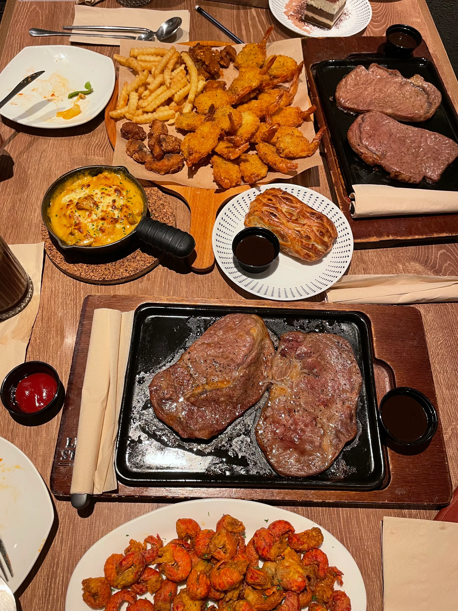
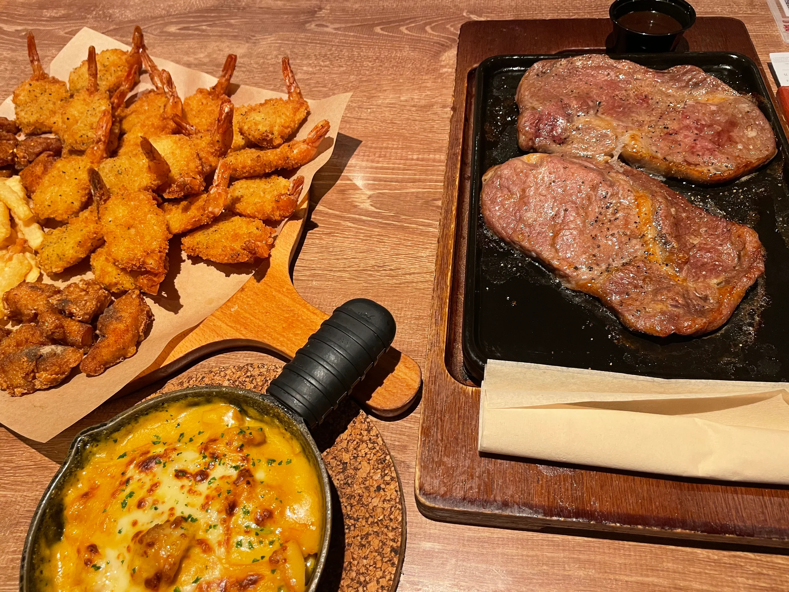
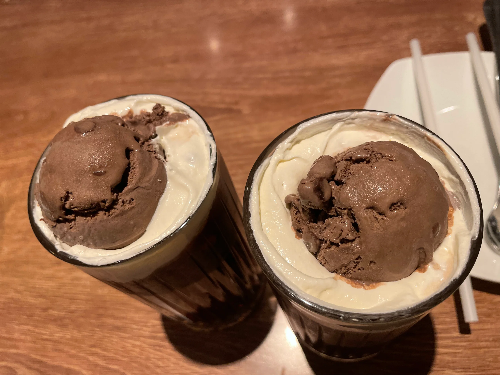

## 技术相关

**V3DragBento**
GitHub: <https://github.com/pinky-pig/what-is-v3-bento>
NPM: <https://www.npmjs.com/package/v3-bento>

自己开发的一个类似于 [Bento](https://bento.me/pinky-pig) 的简化版拖拽效果的组件。主要就是父相子绝定位，碰撞检测到后，向下移动。

## 生活相关

周三的时候是春春生日，3月22~~
正好赶上必胜客自助餐，还从来没吃过，就打算去吃一下。
本来是晚了预约的时间，就去闲鱼上看了一下，原价168，有个小姐姐出178，于是就买了跟女朋友一起去吃~~~
第一次去吃必胜客，感觉还是不错的，不过感觉没吃回本。

周末的时候还去拍了登记照片~~下次贴出来，嘻嘻🥰周六要去领证了，开心开心~~~
