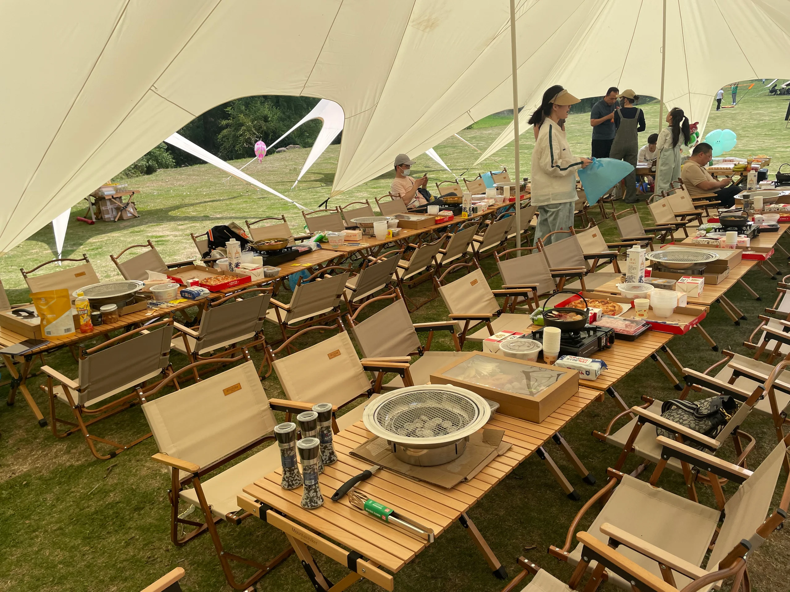
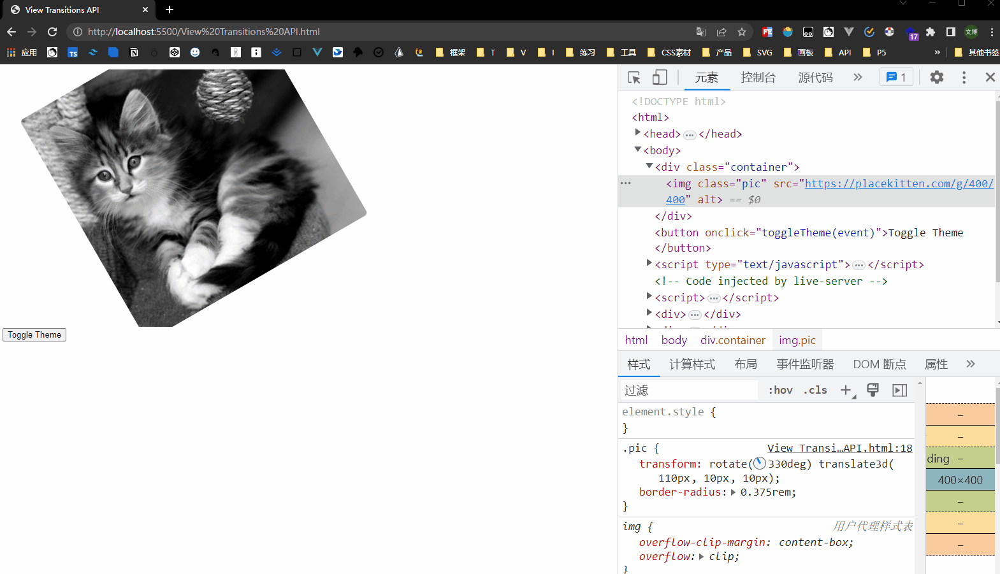

## 技术相关

**Playwright screenshots**

在看推特的时候，看到了一篇推文，在[网站](https://cali.so/)中直接预览网址的截图，感觉很有意思。看他下面的回复，是利用 _Playwright_ 使用一个 chromium 的 headless 模式，然后截图，然后返回给前端。由于他直接使用的 Next.js ，所以更简单，直接在前端项目中使用。

然后 Google 了一下，发现 YouTube 上有个教程 <https://www.youtube.com/watch?v=t95Jo1Wdljw> ， 然后他的 GitHub 上也有源码 <https://github.com/colbyfayock/my-web-archive> 。

于是我便想在 Nuxt.js 上也重现一下😁

当然，首先肯定是要在 Node.js 环境下实现一下，这里是 code 。

```javascript
// core
const fs = require('node:fs')
const { chromium } = require('playwright');

(async () => {
  // 第一步：启动浏览器并打开新页面
  const browser = await chromium.launch()
  const page = await browser.newPage()
  // 第二步：加载网页并等待 DOM 准备就绪
  await page.goto('https://www.baidu.com')
  await page.waitForLoadState('domcontentloaded')
  // 第三步：将整个页面截图并保存为文件
  await page.screenshot({ path: 'example.png' })
  // 第四步：关闭浏览器
  await browser.close()
  console.log('截图已保存')
})()

```

```json
// package.json
{
  "scripts": {
    "test": "node index.js"
  },
  "dependencies": {
    "fs": "^0.0.1-security",
    "playwright": "^1.14.1"
  }
}
```

详细在 Nuxt.js 的使用，在后面会再补充🤣。

**Chromium View Transitions API Issue**
Bug Gif:



Bug 复现 Code：

```html
<!doctype html>
<html>
  <head>
    <meta charset="utf-8" />
    <meta http-equiv="X-UA-Compatible" content="IE=edge" />
    <meta
      name="viewport"
      content="initial-scale=1.0, user-scalable=no, width=device-width"
    />
    <title>View Transitions API</title>
    <style>
      html.dark {
        background: #222;
      }
      html {
        background: #fff;
      }
      .pic {
        transform: rotate(330deg) translate3d(110px, 10px, 10px);
        border-radius: 0.375rem;
      }
      .container {
        overflow: hidden;
      }

      ::view-transition-old(root),
      ::view-transition-new(root) {
        animation: none;
        mix-blend-mode: normal;
      }

      /* 进入dark模式和退出dark模式时，两个图像的位置顺序正好相反 */
      .dark::view-transition-old(root) {
        z-index: 1;
      }
      .dark::view-transition-new(root) {
        z-index: 999;
      }

      ::view-transition-old(root) {
        z-index: 999;
      }
      ::view-transition-new(root) {
        z-index: 1;
      }
    </style>
  </head>

  <body>
    <div class="container">
      
    </div>

    <button onclick="toggleTheme(event)">Toggle Theme</button>

    <script type="text/javascript">
      const duration = 1000
      function toggleTheme(event) {
        const x = event.clientX
        const y = event.clientY
        const endRadius = Math.hypot(
          Math.max(x, innerWidth - x),
          Math.max(y, innerHeight - y),
        )

        let isDark = false
        const transition = document.startViewTransition(() => {
          const root = document.documentElement
          isDark = root.classList.contains('dark')
          root.classList.remove(isDark ? 'dark' : 'light')
          root.classList.add(isDark ? 'light' : 'dark')
        })

        transition.ready.then(() => {
          const clipPath = [
            `circle(0px at ${x}px ${y}px)`,
            `circle(${endRadius}px at ${x}px ${y}px)`,
          ]
          document.documentElement.animate(
            {
              clipPath: isDark ? [...clipPath].reverse() : clipPath,
            },
            {
              duration,
              easing: 'ease-in',
              pseudoElement: isDark
                ? '::view-transition-old(root)'
                : '::view-transition-new(root)',
            },
          )
        })
      }
    </script>
  </body>
</html>
```

## 生活相关

周六去参见了公司团建，同事们感觉都有点抗拒，我猜主要是因为占用了周六，而且天气好热，说不定还会有一些思想教育或是无聊的团体游戏。但是我看了活动安排。其实觉得还行啊，上午看电影 《惊天救援》 ，然后去露营。

我跟春春早上七点多就醒了，然后坐地铁赶过去，刚好电影开始。看完了电影之后的感觉，只能说剧情都能猜得到，像是一部消防宣传片。。。不过场面还行，挺好看的。

看完电影，骑着电动车，顶着大太阳，直冲露营地。我们到的时候，他们还没到多少人，直接开吃！！

然后饭后歇了一会就开溜了😁，太晒了，而且还有集体游戏，我可不想参加。

希望后面自己买一些露营的装备，然后自己去露营，感觉还是挺有意思的。
