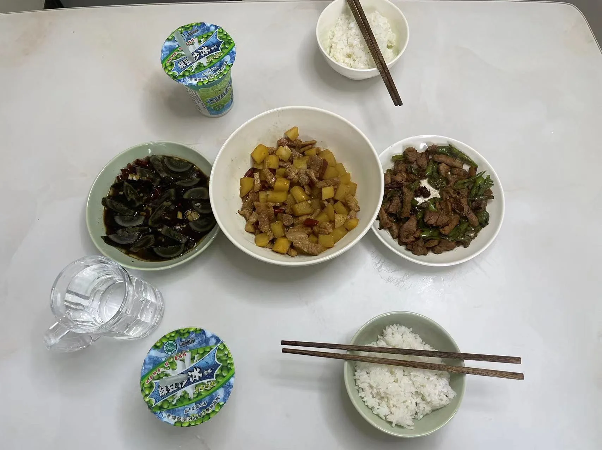
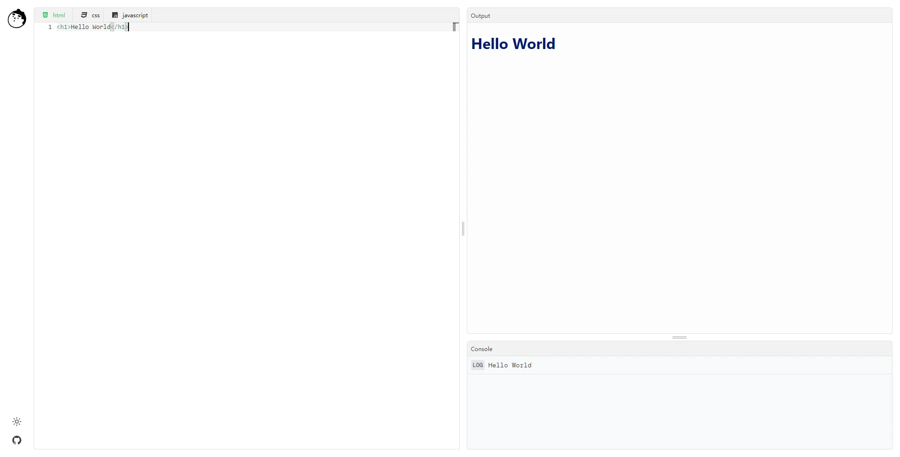
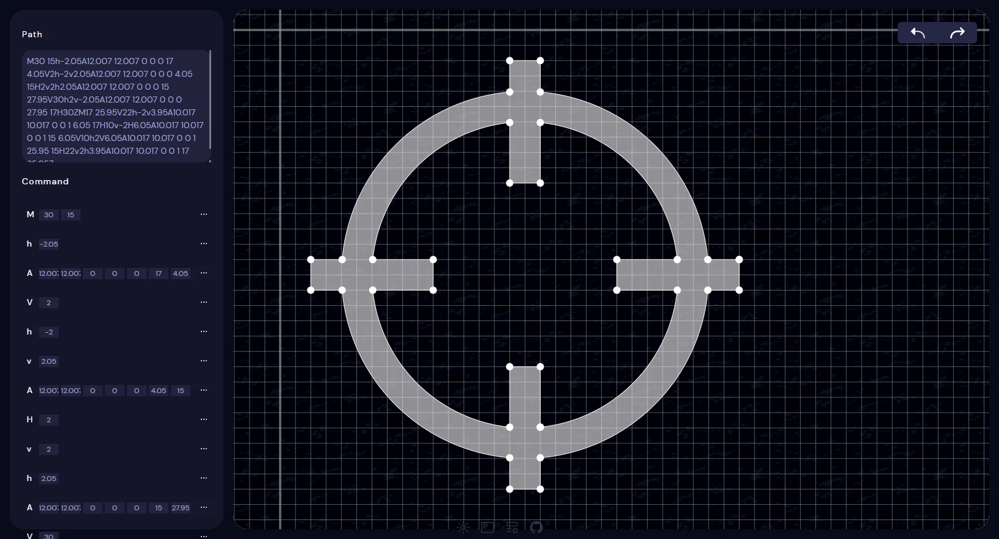
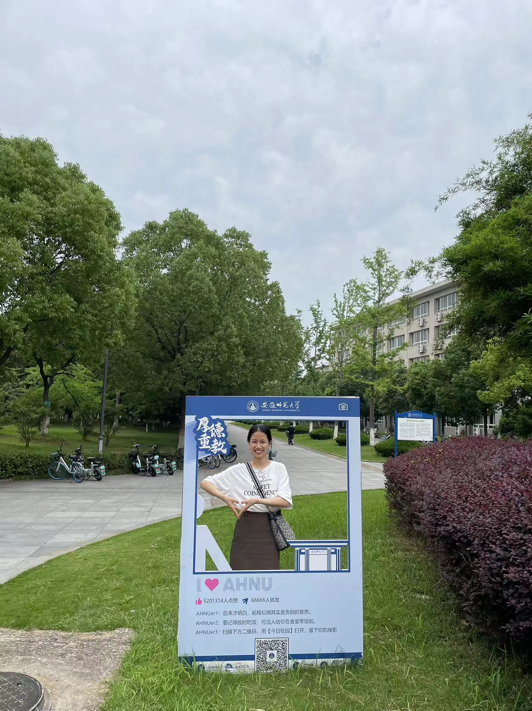
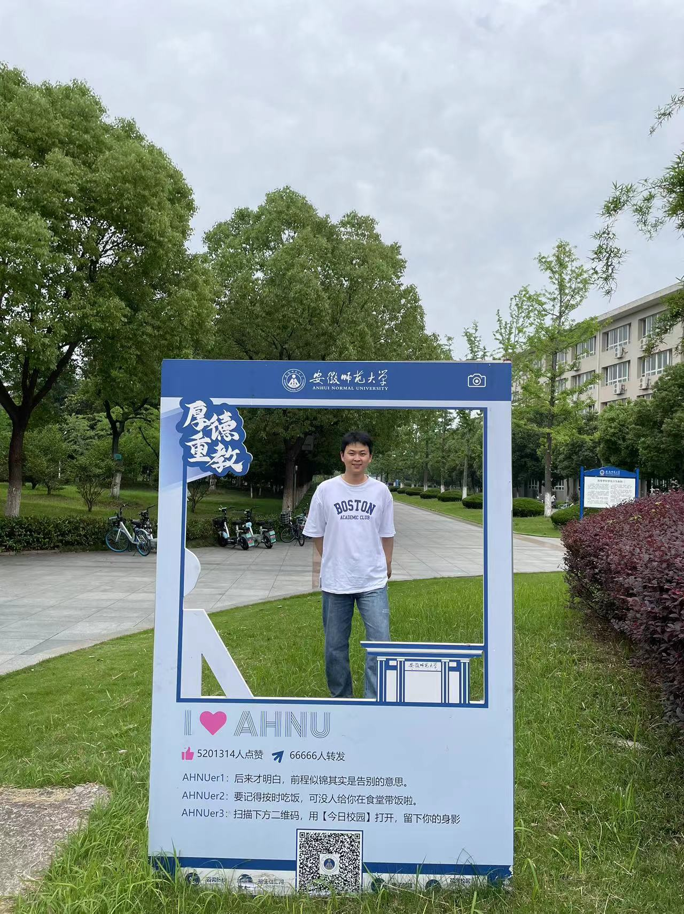
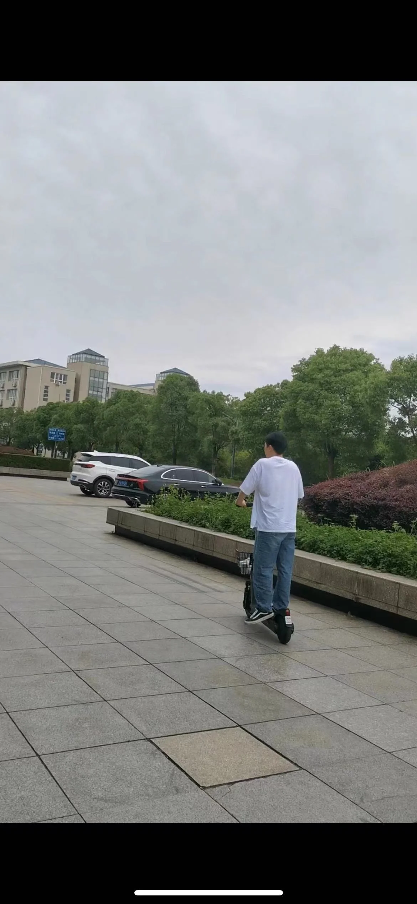
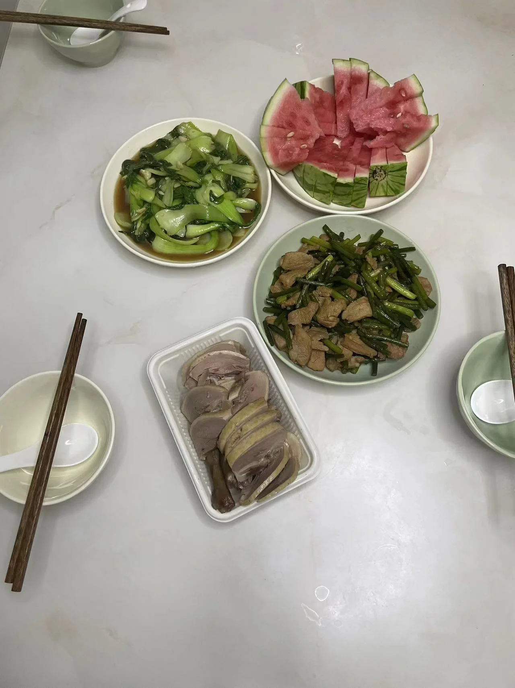

## 技术相关

**HTML Playground**

阅读了 VueUse 的 [Playground](https://play.vueuse.org/) 源码，并写了一个 [HTML](https://playground.mmeme.me/) 的渲染器。

技术也就是使用 monaco-editor 来实现编辑器，然后使用 postMessage 来实现与 iframe 之间的通信。
。稍微跟原来不一样的就是渲染 HTML 的时候， DOM 中的 script 标签的运行。具体的话，可以参考我仓库中的代码：<https://github.com/pinky-pig/what-is-my-html-playground>

**SVG-Path-Editor**

准备将之前的半成品 SVG 编辑器重构一下，并且完善一下功能，然后到时候添加到我的博客中。

## 生活相关

第一天就去了安师大，开车在路上堵了好久好久，从来没有开过那么远的路程，全程还是有点紧张的。开车过去三四个小时，晚上天黑了，路上还是有点害怕的，不过还好，只用了不到俩小时就顺利到达了目的地。

在学校里，还是熟悉的场景，似乎没有任何变化。跟春春的校园爱情一直走到现在，如今再回头看曾经走过的路，还是有点感慨的，回忆青春吧，但更多的是为现在的自己的生活感到幸福甜蜜。而且还是跟春春一起回到校园，感觉很好😁。

还在食堂买了好多好多绿豆冰沙，滑了共享滑板，还在教室睡了一觉，上了个厕所😂。

剩下的假期，在房子里做饭。厨艺菜鸟的我，做的饭菜只能说家常小炒，不过还是很开心的，春春也鼓励我说很好吃🤣。

希望以后慢慢学会做饭，多做好吃的。

