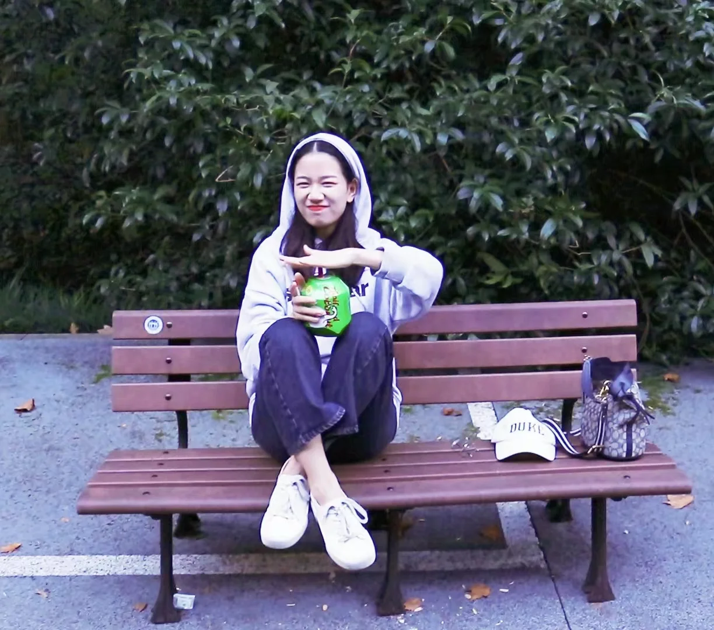
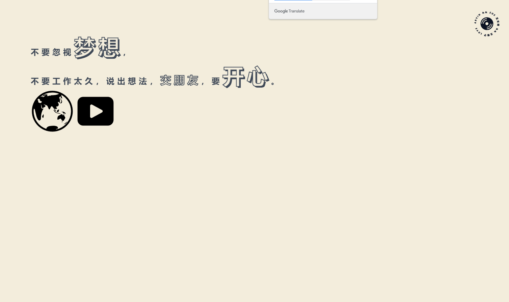
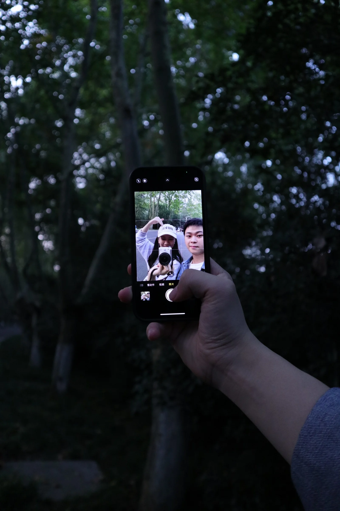
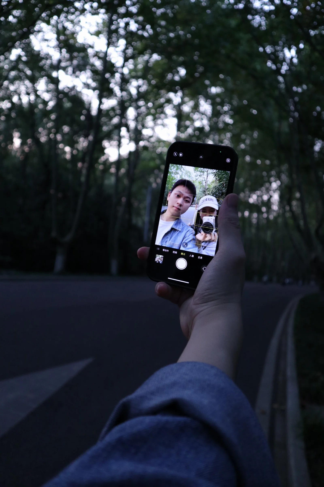
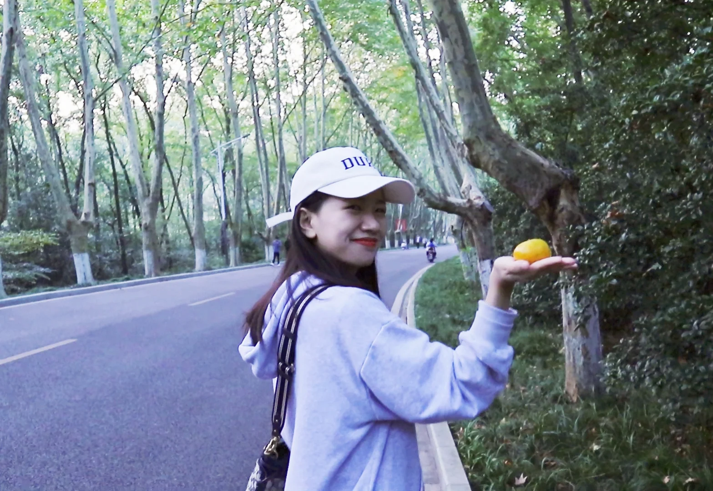

## 技术相关

**学习 React**

这空闲的一周，学习了一下 React 的基本使用以及一些生态库，开发了一个这种鼠标轨迹的小网页。
顺便学习了一下 chrome 支持的 view-transition-api 做了一个切换的效果。

其实这周也主要是了解一些组价传值，组件封装，以及 useRef useState 的用法。

**view-transition-api**

学习了一下，其实也就是过渡前截了一张图，过渡后的一张图。然后前后如果有元素有共同的 view-transition-name ，那么就会产生过渡效果，当然这个效果可以自己自定义，默认是传送过渡过去。

然后可以跟 DOM.animate() 或者 transition promise 结合起来。

## 生活相关

这周休息一下，去拍了照，春春真好看。

## 本周阅读
