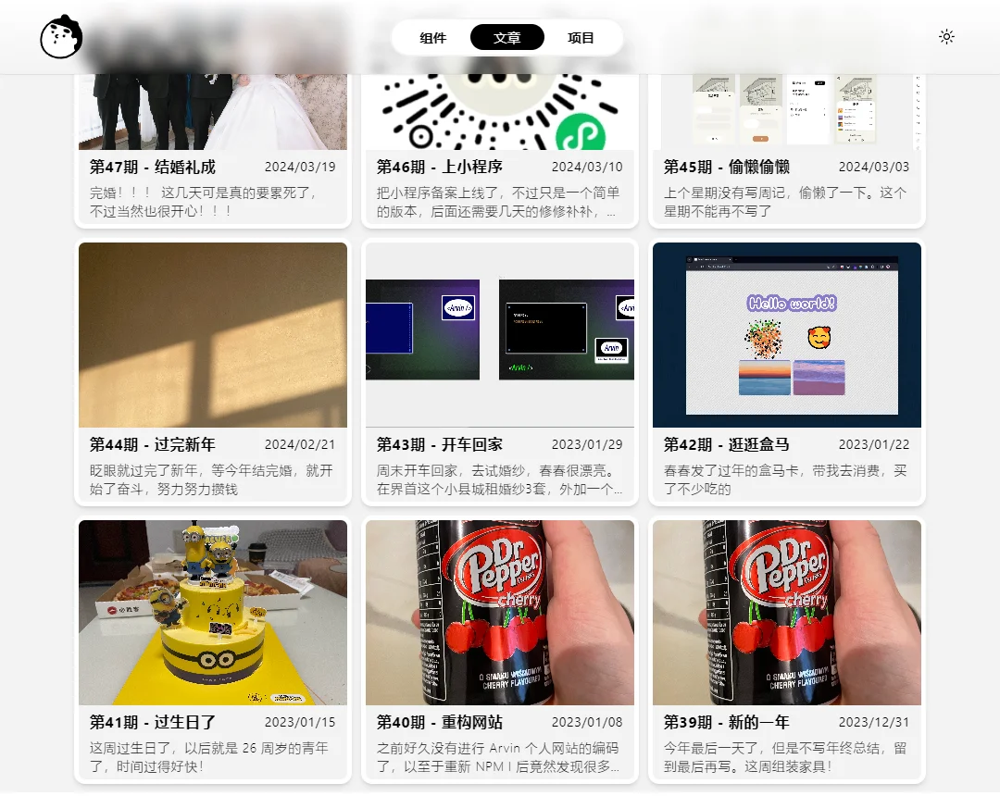

## 技术相关

> https://github.com/antfu/antfu.me/ > https://github.com/shellingfordly/shellingfordly.github.io/

之前好久没有进行 Arvin 个人网站的编码了，以至于重新 NPM I 后竟然发现很多依赖过期了，项目跑不起来。那算了，将 Nuxt3 改用为 Vue3 吧。一些接口性的内容暂时停了。

**重构 Arvin**

## 生活相关

## 本周阅读
